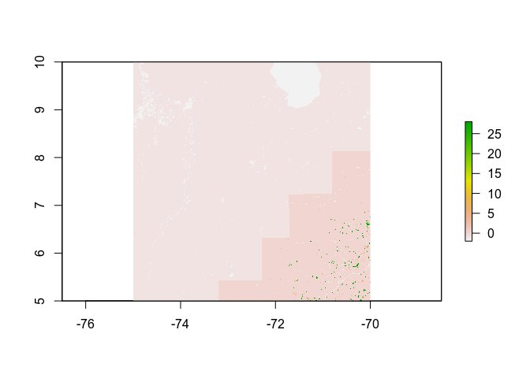
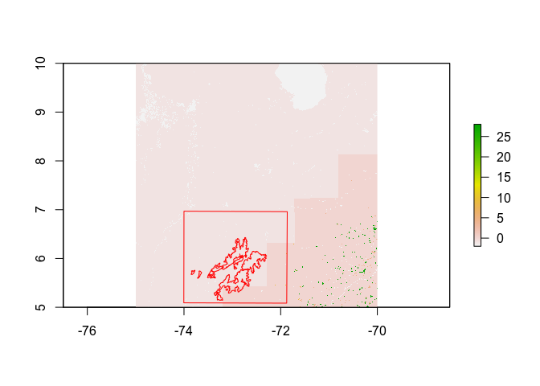

LandTrendr-Paramo - FireCCIS1SA10 check
================
James Millington
2021-07-30

Checking for overlap of [FireCCIS1SA10
data](https://geogra.uah.es/fire_cci/fireccis1sa10.php) extent with our
study area

``` r
library(raster)
library(sf)
```

Load FireCCIS1SA10 data and plot

``` r
cci <- raster("Data/FireCCIS1SA1/20170101-ESACCI-L3S_FIRE-BA-SAR-AREA_h21v16-fv1.0/20170101-ESACCI-L3S_FIRE-BA-SAR-AREA_h21v16-fv1.0-JD.tif")
plot(cci)
```

<!-- -->

Projection of `cci` is +proj=longlat +datum=WGS84 +no\_defs +ellps=WGS84
+towgs84=0,0,0

Load paramo boundary shapefile

``` r
GISpath <- "/home/james/OneDrive/Research/Projects/ColombiaBIO/Fire/Fire GIS Files/" #linux
buf <- st_read(paste0(GISpath,"500mbufferOfComplejos/GroundTruthingBuffer500m.shp"))

#set crs of shp to same as for cci raster
buf <- st_transform(buf, "+proj=longlat +datum=WGS84 +no_defs +ellps=WGS84 +towgs84=0,0,0")
```

Load landsat raster

``` r
dat1 <- raster("Data/ClearImages/ClearJan0.tif")
```

Projection of `dat1` is +proj=utm +zone=18 +datum=WGS84 +units=m
+no\_defs +ellps=WGS84 +towgs84=0,0,0

Create polygon of our max study extent

``` r
bb <- bbox(dat1)

#following from https://gis.stackexchange.com/a/403979
bb_pol = st_polygon(
  list(
    cbind(
      bb[1,][c(1,2,2,1,1)], 
      bb[2,][c(1,1,2,2,1)])
  )
)

#set projection to original raster (dat1)
bb_pol = st_sfc(bb_pol, crs="+proj=utm +zone=18 +datum=WGS84 +units=m +no_defs +ellps=WGS84 +towgs84=0,0,0")
#reproject to cci raster
bb_pol <- st_transform(bb_pol, "+proj=longlat +datum=WGS84 +no_defs +ellps=WGS84 +towgs84=0,0,0")
```

Now compare extents

``` r
plot(cci)
plot(st_geometry(buf), add=T, border='red')
plot(st_geometry(bb_pol), add=T, border='red')
```

<!-- -->

Green specs are fires detected by CCI, dark pink is the limit of CCI
study area, our Paramo study areas are in red. So there appears to be
very little overlap of our study areas and no fires (or very few).
