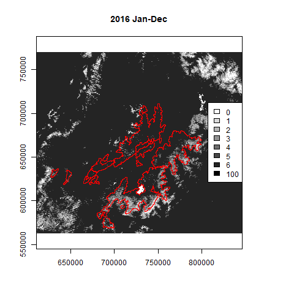
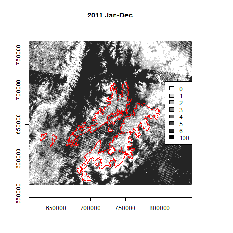
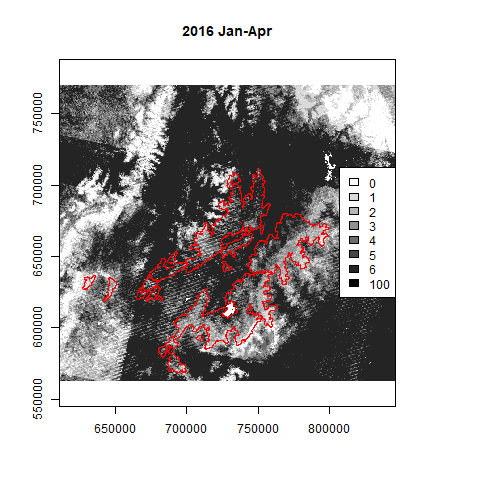
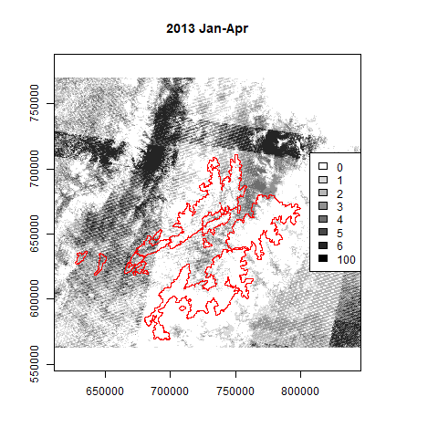
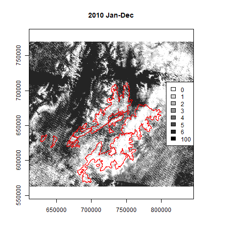

 
# Clear Images Analysis

## Rationale
Our Paramo study region is characterised by high cloud cover. LandTrendR requires that we specify a window of time during a year to analyse images for change detection. Previous papers have recommended the window should correspond with the growing season. However, our study area is in the tropics with no clearly defined growing season. Furthermore, with high levels of cloud cover we may not be able to limit ourselves to the most physically-appropriate window from the perspective ofchange detection.   

Here we examine how long the window needs to be to maximise the number of cloud-free pixels. We want a window as short as possible to detect change, but longer window will allow greater probability of cloud-free pixels. 

Ultimately we can compare three window lengths:

1. current best based on physical properties (Jan-Apr, because anecdotally this is the anthro fire season)
2. entire year-long window
3. trade-off window between the 1. and 2. (most pixels for shortest window)

Identifying the length of window 3. demands examining the number of cloud free pixels in windows of varying length. _Question: do these windows always need to start from Jan or could they start later in the year?_

## Data 
  
There data are for 2010-2019 with the following file-naming convention:

- ClearMon0 is 2010
- ClearMon5 is 2015


### Visualise Examples of the Data 
```{r message=F}
library(raster)

dat1 <- raster("Data/ClearImages/ClearJan0.tif")
dat2 <- raster("Data/ClearImages/ClearFeb0.tif")

st <- stack(dat1,dat2)
sd <- sum(st)

plot(dat1, main="Image1")
plot(dat2, main = "Image2")
plot(sd, main="Sum")

```
### Check masking

First, read shp and check it aligns with raster
```{r message=F, warning=F}
library(sf)
GISpath <- "/home/james/OneDrive/Research/Projects/ColombiaBIO/Fire/Fire GIS Files/" #linux
#GISpath <- "E:/OneDrive - King's College London/Research/Projects/ColombiaBIO/Fire/Fire GIS Files/"  #windows

buf <- st_read(paste0(GISpath,"500mbufferOfComplejos/GroundTruthingBuffer500m.shp"))

#set crs of shp to same as for raster
buf <- st_transform(buf, "+proj=utm +zone=18 +datum=WGS84 +units=m +no_defs +ellps=WGS84 +towgs84=0,0,0")

#check 
plot(sd)
plot(st_geometry(buf), add=T)
```

Now rasterise the buffer shp and use this as a mask
```{r} 

buf_r <- rasterize(buf, sd, field=1)
sd_b <- mask(sd, buf)

plot(buf_r)
plot(sd_b)
```

We can check the number of cells in the masked raster (compared to the original image0
```{r}

print(paste0("Cells in mask: ", cellStats(buf_r, sum)))

print(paste0("Cells in original: ", ncell(buf_r)))

```

Save the raster to file for use elsewhere:
```{r eval=F}
writeRaster(buf_r, paste0(GISpath,"500mbufferOfComplejos/GroundTruthingBuffer500m_mask.tif"))

```


### Create Data Summary

The following script generates summary counts of cloud-free pixels for Paramo, examining different windows of time. Summary is by Year, StartMonth and WindowLength and output is counts of pixels with 0,1,2,3,4,5,6+ cloud free images in a given window. The output data file (csv) is window-per-line. See further comments in the code. 

As this script takes a while to run, it is presented here for completeness, but best run using ClearImages.r independently. 

```{r eval=F}

library(raster)
library(tidyverse)
library(RColorBrewer)
library(sf)

#####
#FUNCTIONS

#function to create image filename from year and month values
imageFilename <- function(yr,mon){
  
  y = yr %% 2010
  m = month.abb[mon]    #month.abb is built-in 
  fn = paste0("Clear",m,y,".tif")
  #print(fn)
  return(fn)
  
}

#function to add data for this window to the summary data tibble 
appendClearData <- function(cDt, yr, ws, wl, counts, lf){
  
  #set count variables from the frequency table
  zeros <- ones <- twos <- threes <- fours <- fives <- sixplus <- 0
  zeros <- counts[1,2]
  if(lf > 1) ones <- counts[2,2]
  if(lf > 2) twos <- counts[3,2]
  if(lf > 3) threes <- counts[4,2]
  if(lf > 4) fours <- counts[5,2]
  if(lf > 5) fives <- counts[6,2]
  if(lf > 6) sixplus <- sum(counts[7:lf,2])
  
  #append data to tibble
  cDt <- cDt %>% add_row(tibble_row(
    Year = yr,
    WindowStart = ws,
    WindowLen  = wl, 
    Count0 = zeros,
    Count1 = ones,
    Count2 = twos,
    Count3 = threes,
    Count4 = fours,
    Count5 = fives,
    Count6p = sixplus),
    Max = lf-1)
  
  #return tibble (overwrite)
  return(cDt)
}

#function to write raster to png
rasPNG <- function(ras, yr, mons) {
  
  png(filename=paste0(path,"ClearImagesTotals_",yr,"_",month.abb[head(mons,1)],"-",month.abb[tail(mons,1)],".png"))
  
  #first plot without legend
  plot(ras, breaks=mycuts, col=mypal(length(mycuts)), legend=FALSE, main=paste0(yr," ",month.abb[head(mons,1)],"-",month.abb[tail(mons,1)]))
  legend("right", legend=as.character(mycuts),fill=mypal(length(mycuts)))   #add custom legend
  plot(st_geometry(buf), border="red",add=T) #add paramo buffer area
  
  dev.off()
}


#####
#INPUTS
Years <- seq(2019,2019,1)   #list of Years to analyse
StartMonth <- seq(1,1,1)  #list of StartMonths to analyse (1 is Jan, 12 is Dec)
path <- "Data/ClearImages/" #path to data directory

#structure for output summary data
clearData_image <- tibble(
  Year = numeric(),         #year this window is in
  WindowStart = numeric(),  #month in which the window starts
  WindowLen = numeric(),    #number of months in this window
  Count0 = numeric(),       #count of pixels with 0 cloud free images
  Count1 = numeric(),       #... 1 cloud free image
  Count2 = numeric(),       #... 2 cloud free images
  Count3 = numeric(),       #... 3 cloud free images
  Count4 = numeric(),       #... 4 cloud free images
  Count5 = numeric(),       #... 5 cloud free images
  Count6p = numeric(),      #count of pixels with 6 OR MORE cloud free images
  Max = numeric()           #max number of cloud free images in this window (should be equivalent to total number of images in the window)
)

clearData_mask <- clearData_image

#read mask data 
#GISpath <- "/home/james/OneDrive/Research/Projects/ColombiaBIO/Fire/Fire GIS Files/" #linux
GISpath <- "E:/OneDrive - King's College London/Research/Projects/ColombiaBIO/Fire/Fire GIS Files/"  #windows
  
buf <- st_read(paste0(GISpath,"500mbufferOfComplejos/GroundTruthingBuffer500m.shp"))
buf <- st_transform(buf, "+proj=utm +zone=18 +datum=WGS84 +units=m +no_defs +ellps=WGS84 +towgs84=0,0,0")
buf_r <- raster(paste0(GISpath,"500mbufferOfComplejos/GroundTruthingBuffer500m_mask.tif"))

#plotting parms
mycuts <- c(0,1,2,3,4,5,6,100)
mypal <- colorRampPalette(c("white","black"))


#####
#ANALYSIS
for(i in Years){
  print(paste0("Year: ",i))  #loop on years of analysis
  
  for(j in StartMonth){
    print(paste0("Start Mon: ",month.abb[j]))  #loop on StartMonth of analysis
    
    max_wl = 13 - j   #max window length possible for this StartMonth (12 for Jan, 11 for Feb, ... 1 for Dec)
    Lengths <- seq(from=1,to=max_wl,by=1)   #create a list of possible window lengths for next loop
    
    for(k in Lengths){  #loop on possible Window Lengths for this StartMonth
      print(paste0("Window Length: ",k))
      
      
      ##MEMORY MANAGEMENT see https://r-forge.r-project.org/forum/forum.php?thread_id=30946&forum_id=995&group_id=302
      raster_tmp_dir <- "raster_tmp"  ## define the name of a temp directory where raster tmp files will be stored
      dir.create(raster_tmp_dir, showWarnings = F, recursive = T)  ## create the directory
      rasterOptions(tmpdir = raster_tmp_dir)  ## set raster options
      ##
      
      Months <- seq(from=j,length.out=k)  #create list of months for this StartMonth-WindowLength (j-k) combo 
      images <- stack()   #empty stack to hold rasters read in next loop
      
      #create the stack of rasters for this window length
      #loop through months in the StartMonth-WindowLength combo
      for(l in Months){
        ras <- raster(paste0(path,imageFilename(yr=i,mon=l)))  #read raster
        images <- stack(images, ras)  #add to stack
      }
      
      images_mask <- mask(images,buf_r) #apply mask to the stack
      
      freqs <- 0  #create dummy object for frequencies from images
      freqs_mask <- 0 #create dummy object for frequencies from masked images
      
      if(k > 1) { 
        totals <- sum(images)   #if more than one image in the window, calc sum of all images in the stack
        freqs <- freq(totals)   #then calc freq on the sum 
        
        totals_mask <- sum(images_mask)    #if more than one image in the window, calc sum of all images in the stack
        freqs_mask <- freq(totals_mask)    #then calc freq on the sum 
        
        #if StartMonth is Jan, output .tif of cell sums (write full image only, can mask this later if needed in subsequent analysis)
        if(j==1) writeRaster(totals, filename=paste0(path,"ClearImagesTotals_",i,"_",month.abb[head(Months,1)],"-",month.abb[tail(Months,1)],".tif"),datatype="INT2S")
        rasPNG(ras=totals,yr=i, mons=Months)    #always write png 
        
      
      } else {
        freqs <- freq(images,merge=T)             #else, only one image in the stack, calc freq on this using merge=T
        freqs_mask <- freq(images_mask,merge=T)   #else, only one image in the stack, calc freq on this using merge=T
        
        #if StartMonth is Jan, output raster of cell sums (write full image only, can mask this later if needed in subsequent analysis)
        if(j==1) writeRaster(images, filename=paste0(path,"ClearImagesTotals_",i,"_",month.abb[head(Months,1)],"-",month.abb[tail(Months,1)],".tif"),datatype="INT2S")
        rasPNG(ras=images,yr=i, mons=Months)      #always write png 
        
      }

      lenfreq <- length(freqs[,1])  #returns max count + 1
      lenfreq_mask <- length(freqs_mask[,1])  #returns max count + 1
      
      #add data for this window start-length combo to the summary data table
      clearData_image <- appendClearData(cDt=clearData_image,yr=i, ws=j, wl=k, counts=freqs,lf=lenfreq)
      clearData_mask <- appendClearData(cDt=clearData_mask,yr=i, ws=j, wl=k, counts=freqs_mask,lf=lenfreq_mask)

      ## remove the tmp dir
      unlink(raster_tmp_dir, recursive = T, force = T)
      
    }  #end [Window] Lengths loop
  }  #end StartMonth loop
}  #end Years loop

#output summary data tables
write_csv(x=clearData_image,
          path=paste0(path,"ClearImages_ImageSummary_",head(Years,1),"-",tail(Years,1),"_",month.abb[head(StartMonth,1)],"-",month.abb[tail(StartMonth,1)],".csv"))

write_csv(x=clearData_mask,
          path=paste0(path,"ClearImages_MaskSummary_",head(Years,1),"-",tail(Years,1),"_",month.abb[head(StartMonth,1)],"-",month.abb[tail(StartMonth,1)],".csv"))


```


### Initial Summary Visualization

```{r message=F}

library(tidyverse)
path <- "Data/ClearImages/" #path to data directory
dat <- read_csv(paste0(path,"ClearImagesSummary_2010-2011_Jan-Dec.csv"))

```


```{r}

#plot count0 against window length (group by year, windows starting from Jan)

dat %>%
  filter(WindowStart == 1 & Year < 2012) %>%
  mutate(across(matches("Year"),as.factor)) %>%
  mutate(across(matches("WindowLen"),as.factor)) %>%
  ggplot(aes(x=WindowLen, y=Count0, fill=Year)) +
  geom_bar(stat="identity", position=position_dodge()) +
  scale_y_continuous(name="Non-Cloud Free (count pixels)", labels = scales::comma) +
  ggtitle("All Windows Start in Jan")
```

```{r}
dat %>%
  filter(WindowStart == 1 & Year < 2012) %>%
  mutate(across(matches("Year"),as.factor)) %>%
  mutate(across(matches("WindowLen"),as.factor)) %>%
  ggplot(aes(x=WindowLen, y=Count0)) +
  geom_bar(stat="identity", position=position_dodge()) +
  facet_grid(.~Year) +
  scale_y_continuous(name="Non-Cloud Free (count pixels)", labels = scales::comma) +
  ggtitle("All Windows Start in Jan")
```

In next plot, `Count0` is count of pixels that are not cloud free in the window, `Count1` is count of pixels that have one cloud free image in the window... etc. to `Count6p` which is count of pixels with 6 or more cloud free images in the window. 

```{r}

total_cells <- ncell(dat2)

countprop <- function(num) { num/total_cells } #function to calc prop count of total image size, e.g. https://stackoverflow.com/a/49759987

dat %>%
  filter(WindowStart == 1 & Year < 2012) %>%
  mutate(across(matches("Year"),as.factor)) %>%
  mutate(across(matches("WindowLen"),as.factor)) %>%
  mutate(across(starts_with("Count"), countprop, .names="{col}prop")) %>%  #create proportion columns
  dplyr::select(c(Year,starts_with("Window") | ends_with("prop"))) %>%
  pivot_longer(cols=ends_with("prop"),names_to="Count",values_to="prop") %>%
  ggplot(aes(x=WindowLen, y=prop, fill=Count)) +
  geom_bar(stat="identity",position="fill") +
  facet_grid(.~Year) +
  scale_y_continuous(name="Image Proportion") +
  ggtitle("All Windows Start in Jan")

```


```{r}

#plot count0 (point size) by window length (y) and StartMonth (x)  (shape  by year)

dat %>%
  filter(Year < 2012) %>%
  mutate(across(matches("Year"),as.factor)) %>%
  mutate(across(matches("WindowLen"),as.factor)) %>%
  mutate(across(matches("WindowStart"),as.factor)) %>%
  ggplot(aes(x=WindowLen, y=WindowStart, size=Count0)) +
  #scale_color_gradient(low="yellow", high="red") + 
  geom_point(shape=15) + 
  scale_y_discrete(labels=month.abb) +
  facet_grid(.~Year) + 
  ggtitle("Non-Cloud Free")

```

## Multi-Year January Visualisation

As windows starting in January seem to consistently have the greatest cloud-free pixels, let's focus on that now after having run the script for widows starting only in January and for both entire image and masked to study area. Furthermore, data above show that:

- entire year windws (i.e. WindowLength == 12) have greatest cloud-free images
- there is rapid increase in number of cloud-free pixels until WindowLength == 5 when improvements slow. 

So, let's focus here on WindowLengths of 12 and 4

```{r message=F}
#load data
path <- "Data/ClearImages/" #path to data directory
dat_Jan_1018 <- read_csv(paste0(path,"ClearImages_ImageSummary_2010-2018_Jan-Jan.csv"))
dat_Jan_1018_mask <- read_csv(paste0(path,"ClearImages_MaskSummary_2010-2018_Jan-Jan.csv"))

```

### Entire Image, Window Length 12
```{r}

total_cells <- ncell(buf_r)

countprop <- function(num) { num/total_cells } #function to calc prop count e.g. https://stackoverflow.com/a/49759987

dat_Jan_1018 %>%
  filter(WindowLen == 12) %>%
  mutate(across(matches("Year"),as.factor)) %>%
  mutate(across(matches("WindowLen"),as.factor)) %>%
  mutate(across(starts_with("Count"), countprop, .names="{col}prop")) %>%  #create proportion columns
  dplyr::select(c(Year,starts_with("Window") | ends_with("prop"))) %>%
  pivot_longer(cols=ends_with("prop"),names_to="Count",values_to="prop") %>%
  ggplot(aes(x=Year, y=prop, fill=Count)) +
  geom_bar(stat="identity",position="fill") +
  #facet_grid(.~Year) +
  scale_y_continuous(name="Image Proportion") +
  ggtitle("Entire Image, Window Length 12")  


dat_Jan_1018 %>%
  filter(WindowLen == 12) %>%
  mutate(across(matches("Year"),as.factor)) %>%
  mutate(across(matches("WindowLen"),as.factor)) %>%
  mutate(across(starts_with("Count"), countprop, .names="{col}prop")) %>%  #create proportion columns
  dplyr::select(c(Year,Count0prop,starts_with("Window"))) %>% 
  pivot_longer(cols=ends_with("prop"),names_to="Count",values_to="prop") %>% 
  ggplot(aes(x=Year, y=prop, fill=Count)) +
  geom_bar(stat="identity") +
  #facet_grid(.~Year) +
  scale_y_continuous(name="Image Proportion") +
  ggtitle("Entire Image, Window Length 12") +
  geom_text(aes(label=round(prop,3),x=Year,y=prop), position=position_dodge(width=0.8), vjust=-0.3)

```

So, in 2016 we have a full-year window with almost 100% cloud-free images, but in 2010 and 2011 we have ~7% of pixels with no cloud-free image.

 



### Entire Image, Window Length 4
```{r}

total_cells <- ncell(buf_r)

countprop <- function(num) { num/total_cells } #function to calc prop count e.g. https://stackoverflow.com/a/49759987

dat_Jan_1018 %>%
  filter(WindowLen == 4) %>%
  mutate(across(matches("Year"),as.factor)) %>%
  mutate(across(matches("WindowLen"),as.factor)) %>%
  mutate(across(starts_with("Count"), countprop, .names="{col}prop")) %>%  #create proportion columns
  dplyr::select(c(Year,starts_with("Window") | ends_with("prop"))) %>%
  pivot_longer(cols=ends_with("prop"),names_to="Count",values_to="prop") %>%
  ggplot(aes(x=Year, y=prop, fill=Count)) +
  geom_bar(stat="identity",position="fill") +
  #facet_grid(.~Year) +
  scale_y_continuous(name="Image Proportion") +
  ggtitle("Entire Image, Window Length 4")  


dat_Jan_1018 %>%
  filter(WindowLen == 4) %>%
  mutate(across(matches("Year"),as.factor)) %>%
  mutate(across(matches("WindowLen"),as.factor)) %>%
  mutate(across(starts_with("Count"), countprop, .names="{col}prop")) %>%  #create proportion columns
  dplyr::select(c(Year,Count0prop,starts_with("Window"))) %>% 
  pivot_longer(cols=ends_with("prop"),names_to="Count",values_to="prop") %>% 
  ggplot(aes(x=Year, y=prop, fill=Count)) +
  geom_bar(stat="identity") +
  #facet_grid(.~Year) +
  scale_y_continuous(name="Image Proportion") +
  ggtitle("Entire Image, Window Length 4") +
  geom_text(aes(label=round(prop,3),x=Year,y=prop), position=position_dodge(width=0.8), vjust=-0.3)

```

When we look at a window length of 4 months (starting in Jan) for the entire image, we see earlier years have upto 25% pixels are not cloud-free (e.g. 2013), although again 2016 is quite clear.  




### Study Area, Window Length 12
```{r}

total_cells <- cellStats(buf_r, sum)

countprop <- function(num) { num/total_cells } #function to calc prop count e.g. https://stackoverflow.com/a/49759987

dat_Jan_1018_mask %>%
  filter(WindowLen == 12) %>%
  mutate(across(matches("Year"),as.factor)) %>%
  mutate(across(matches("WindowLen"),as.factor)) %>%
  mutate(Count6p = 5719877 - (Count0 + Count1 + Count2 + Count3 + Count4 + Count5)) %>%   #fix count6p cells (mask didn't work properly (number is cells in study area minus other classes)
  mutate(across(starts_with("Count"), countprop, .names="{col}prop")) %>%  #create proportion columns
  dplyr::select(c(Year,starts_with("Window") | ends_with("prop"))) %>%
  pivot_longer(cols=ends_with("prop"),names_to="Count",values_to="prop") %>%
  ggplot(aes(x=Year, y=prop, fill=Count)) +
  geom_bar(stat="identity",position="fill") +
  #facet_grid(.~Year) +
  scale_y_continuous(name="Study Area Proportion") +
  ggtitle("Study Area, Window Length 12")  


dat_Jan_1018_mask %>%
  filter(WindowLen == 12) %>%
  mutate(across(matches("Year"),as.factor)) %>%
  mutate(across(matches("WindowLen"),as.factor)) %>%
    mutate(Count6p = 5719877 - (Count0 + Count1 + Count2 + Count3 + Count4 + Count5)) %>%   #fix count6p cells (mask didn't work properly (number is cells in study area minus other classes)
  mutate(across(starts_with("Count"), countprop, .names="{col}prop")) %>%  #create proportion columns
  dplyr::select(c(Year,Count0prop,starts_with("Window"))) %>% 
  pivot_longer(cols=ends_with("prop"),names_to="Count",values_to="prop") %>% 
  ggplot(aes(x=Year, y=prop, fill=Count)) +
  geom_bar(stat="identity") +
  #facet_grid(.~Year) +
  scale_y_continuous(name="Study Area Proportion") +
  ggtitle("StudyArea, Window Length 12") +
  geom_text(aes(label=round(prop,3),x=Year,y=prop), position=position_dodge(width=0.8), vjust=-0.3)

```

Considering the study area only (for a 12 month window), we find that this is generally more cloudy in early year, but not so bad from 2014 onwards. 



### Study Area, Window Length 4
```{r}

total_cells <- cellStats(buf_r, sum)

countprop <- function(num) { num/total_cells } #function to calc prop count e.g. https://stackoverflow.com/a/49759987

dat_Jan_1018_mask %>%
  filter(WindowLen == 4) %>%
  mutate(across(matches("Year"),as.factor)) %>%
  mutate(across(matches("WindowLen"),as.factor)) %>%
  mutate(Count6p = 5719877 - (Count0 + Count1 + Count2 + Count3 + Count4 + Count5)) %>%   #fix count6p cells (mask didn't work properly (number is cells in study area minus other classes)
  mutate(across(starts_with("Count"), countprop, .names="{col}prop")) %>%  #create proportion columns
  dplyr::select(c(Year,starts_with("Window") | ends_with("prop"))) %>%
  pivot_longer(cols=ends_with("prop"),names_to="Count",values_to="prop") %>%
  ggplot(aes(x=Year, y=prop, fill=Count)) +
  geom_bar(stat="identity",position="fill") +
  #facet_grid(.~Year) +
  scale_y_continuous(name="Study Area Proportion") +
  ggtitle("Study Area, Window Length 4")  


dat_Jan_1018_mask %>%
  filter(WindowLen == 4) %>%
  mutate(across(matches("Year"),as.factor)) %>%
  mutate(across(matches("WindowLen"),as.factor)) %>%
    mutate(Count6p = 5719877 - (Count0 + Count1 + Count2 + Count3 + Count4 + Count5)) %>%   #fix count6p cells (mask didn't work properly (number is cells in study area minus other classes)
  mutate(across(starts_with("Count"), countprop, .names="{col}prop")) %>%  #create proportion columns
  dplyr::select(c(Year,Count0prop,starts_with("Window"))) %>% 
  pivot_longer(cols=ends_with("prop"),names_to="Count",values_to="prop") %>% 
  ggplot(aes(x=Year, y=prop, fill=Count)) +
  geom_bar(stat="identity") +
  #facet_grid(.~Year) +
  scale_y_continuous(name="Study Area Proportion") +
  ggtitle("StudyArea, Window Length 4") +
  geom_text(aes(label=round(prop,3),x=Year,y=prop), position=position_dodge(width=0.8), vjust=-0.3)

```

It's a similar issue when we look at 4 month window for the study area, but 2013 is particularly bad with more than half of pixels having no cloud-free image. 

## Concluding Thoughts

- Entire year gives more cloud-free pixels 
- Study area with Jan-Apr windows will lose a lot of data for years prior to 2014
- Study area with Jan-Dec window looks feasible for analysis for 2012 onwardS
- Why is 2014 onwards so much more cloud free? Was a new Landsat sensor added? Some re-calibration?

Next step in analysis is to identify proportion of pixels in the study area with >1 consecutive years with no cloud-free image? i.e. Pixels with one year missing here-or-there could be included in LandTrendR analyses, but pixels with multi-years of missing data should be ommited from the analysis?

What other analyses?
