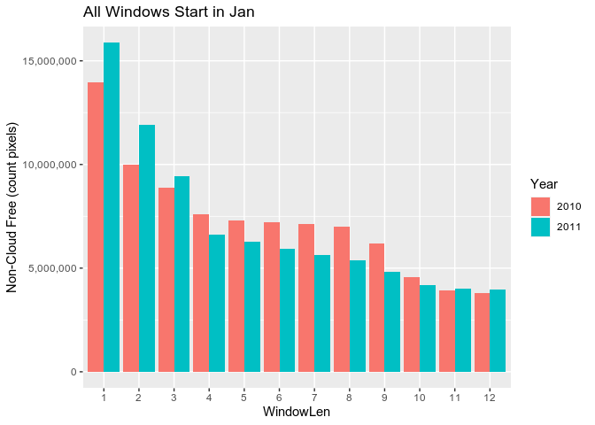
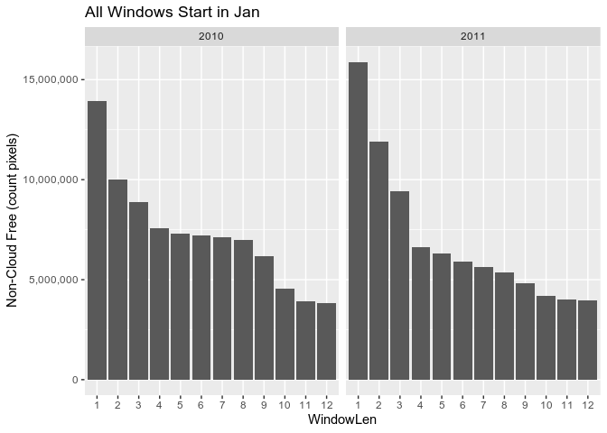
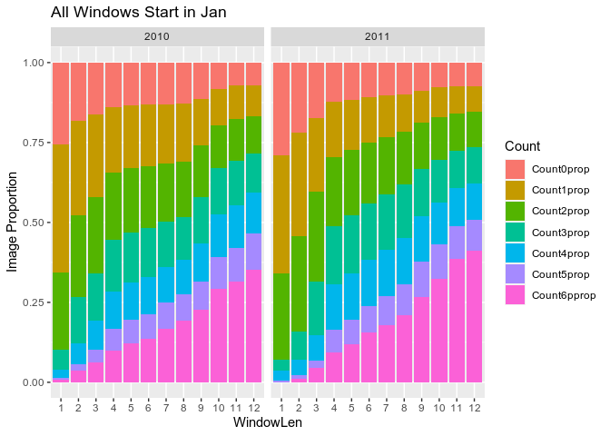
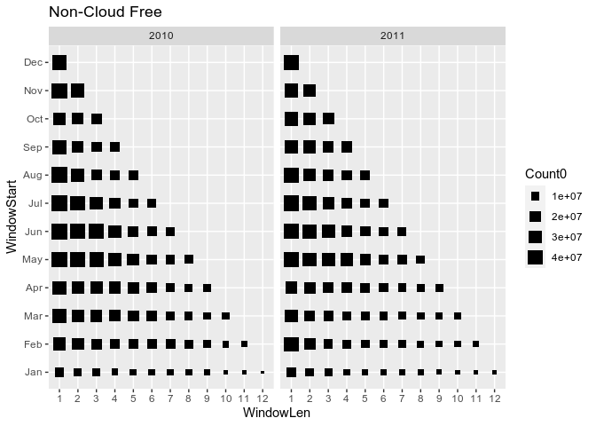

LandTrendr-Paramo Clear Image Analysis
================
James Millington
2020-06-02

# Clear Images Analysis

## Rationale

Our Paramo study region is characterised by high cloud cover. LandTrendR
requires that we specify a window of time during a year to analyse
images for change detection. Previous papers have recommended the window
should correspond with the growing season. However, our study area is in
the tropics with no clearly defined growing season. Furthermore, with
high levels of cloud cover we may not be able to limit ourselves to the
most physically-appropriate window from the perspective ofchange
detection.

Here we examine how long the window needs to be to maximise the number
of cloud-free pixels. We want a window as short as possible to detect
change, but longer window will allow greater probability of cloud-free
pixels.

Ultimately we can compare three window lengths:

1.  current best based on physical properties (Jan-Apr, because
    anecdotally this is the anthro fire season)
2.  entire year-long window
3.  trade-off window between the 1. and 2. (most pixels for shortest
    window)

Identifying the length of window 3. demands examining the number of
cloud free pixels in windows of varying length. *Question: do these
windows always need to start from Jan or could they start later in the
year?*

## Data

There data are for 2010-2019 with the following file-naming convention:
- ClearMon0 is 2010 - ClearMon5 is 2015

### Visualise Examples of the Data

``` r
library(raster)
```

    ## Loading required package: sp

``` r
dat1 <- raster("Data/ClearImages/ClearJan0.tif")
dat2 <- raster("Data/ClearImages/ClearFeb0.tif")

st <- stack(dat1,dat2)
sd <- sum(st)

plot(dat1, main="Image1")
```

<!-- -->

``` r
plot(dat2, main = "Image2")
```

<!-- -->

``` r
plot(sd, main="Sum")
```

<!-- -->

### Create Data Summary

The following script generates summary counts of cloud-free pixels for
Paramo, examining different windows of time. Summary is by Year,
StartMonth and WindowLength and output is counts of pixels with
0,1,2,3,4,5,6+ cloud free images in a given window. The output data file
(csv) is window-per-line. See further comments in the code.

As this script takes a while to run, it is presented here for
completeness, but best run using ClearImages.r independently.

``` r
library(raster)
library(tidyverse)

#function to create image filename from year and month values
imageFilename <- function(yr,mon){
  
  y = yr %% 2010
  m = month.abb[mon]    #month.abb is built-in 
  fn = paste0("Clear",m,y,".tif")
  #print(fn)
  return(fn)
  
}

#INPUTS
Years <- seq(2010,2010,1)   #list of Years to analyse
StartMonth <- seq(10,11,1)  #list of StartMonths to analyse (1 is Jan, 12 is Dec)
path <- "Data/ClearImages/" #path to data directory

#structure for output data
clearData <- tibble(
  Year = numeric(),         #year this window is in
  WindowStart = numeric(),  #month in which the window starts
  WindowLen = numeric(),    #number of months in this window
  Count0 = numeric(),       #count of pixels with 0 cloud free images
  Count1 = numeric(),       #... 1 cloud free image
  Count2 = numeric(),       #... 2 cloud free images
  Count3 = numeric(),       #... 3 cloud free images
  Count4 = numeric(),       #... 4 cloud free images
  Count5 = numeric(),       #... 5 cloud free images
  Count6p = numeric(),      #count of pixels with 6 OR MORE cloud free images
  Max = numeric()           #max number of cloud free images in this window (should be equivalent to total number of images in the window)
)

#start analysis loop
for(i in Years){
  print(paste0("Year: ",i))  #loop in years of analysis
  
  for(j in StartMonth){
    print(paste0("Start Mon: ",month.abb[j]))  #loop on StartMonth of analysis
    
    max_wl = 13 - j   #max window length possible for this StartMonth (12 for Jan, 11 for Feb, ... 1 for Dec)
    Lengths <- seq(from=1,to=max_wl,by=1)   #create a list of possible window lengths for next loop
    
    for(k in Lengths){
      print(paste0("Window Length: ",k))
      
      Months <- seq(from=j,length.out=k)  #create list of months for this StartMonth-WindowLength (j-k) combo 
      images <- stack()   #empty stack to hold rasters read in next loop
      
      #create the stack of rasters for this window length
      #loop through months in the StartMonth-WindowLength combo
      for(l in Months){
        ras <- raster(paste0(path,imageFilename(yr=i,mon=l)))  #read raster
        images <- stack(images, ras)  #add to stack
      }
      
      freqs <- 0  #create dummy object
      
      if(k > 1) { 
        totals <- sum(images)   #if more than one image in the window, calc sum of all images in the stack
        freqs <- freq(totals)   #then calc freq on the sum 
      } else {
        freqs <- freq(images,merge=T)   #if only one image in the stack, calc freq on this using merge=T
      }
      
      lenfreq <- length(freqs[,1])  #returns max count + 1
      
      #set count variables from the frequency table
      zeros <- ones <- twos <- threes <- fours <- fives <- sixplus <- 0
      zeros <- freqs[1,2]
      if(lenfreq > 1) ones <- freqs[2,2]
      if(lenfreq > 2) twos <- freqs[3,2]
      if(lenfreq > 3) threes <- freqs[4,2]
      if(lenfreq > 4) fours <- freqs[5,2]
      if(lenfreq > 5) fives <- freqs[6,2]
      if(lenfreq > 6) sixplus <- sum(freqs[7:lenfreq,2])
      
      #append data to tibble
      clearData <- clearData %>% add_row(tibble_row(
        Year = i,
        WindowStart = j,
        WindowLen  = k, 
        Count0 = zeros,
        Count1 = ones,
        Count2 = twos,
        Count3 = threes,
        Count4 = fours,
        Count5 = fives,
        Count6p = sixplus),
        Max = lenfreq-1)
      
    }  #end [Window] Lengths loop
  }  #end StartMonth loop
}  #end Years loop

write_csv(x=clearData,
          path=paste0(path,"ClearImagesSummary_",head(Years,1),"-",tail(Years,1),"_",month.abb[head(StartMonth,1)],"-",month.abb[tail(StartMonth,1)],".csv"))
```

``` r
library(tidyverse)
```

    ## ── Attaching packages ──────────────────────────────────────────────────────────────────────────────────── tidyverse 1.3.0 ──

    ## ✓ ggplot2 3.3.1     ✓ purrr   0.3.4
    ## ✓ tibble  3.0.1     ✓ dplyr   1.0.0
    ## ✓ tidyr   1.1.0     ✓ stringr 1.4.0
    ## ✓ readr   1.3.1     ✓ forcats 0.5.0

    ## ── Conflicts ─────────────────────────────────────────────────────────────────────────────────────── tidyverse_conflicts() ──
    ## x tidyr::extract() masks raster::extract()
    ## x dplyr::filter()  masks stats::filter()
    ## x dplyr::lag()     masks stats::lag()
    ## x dplyr::select()  masks raster::select()

``` r
path <- "Data/ClearImages/" #path to data directory
dat <- read_csv(paste0(path,"ClearImagesSummary_2010-2011_Jan-Dec.csv"))
```

    ## Parsed with column specification:
    ## cols(
    ##   Year = col_double(),
    ##   WindowStart = col_double(),
    ##   WindowLen = col_double(),
    ##   Count0 = col_double(),
    ##   Count1 = col_double(),
    ##   Count2 = col_double(),
    ##   Count3 = col_double(),
    ##   Count4 = col_double(),
    ##   Count5 = col_double(),
    ##   Count6p = col_double(),
    ##   Max = col_double()
    ## )

### Initial Summary Visualization

``` r
#plot count0 against window length (group by year, windows starting from Jan)

dat %>%
  filter(WindowStart == 1 & Year < 2012) %>%
  mutate(across(matches("Year"),as.factor)) %>%
  mutate(across(matches("WindowLen"),as.factor)) %>%
  ggplot(aes(x=WindowLen, y=Count0, fill=Year)) +
  geom_bar(stat="identity", position=position_dodge()) +
  scale_y_continuous(name="Non-Cloud Free (count pixels)", labels = scales::comma) +
  ggtitle("All Windows Start in Jan")
```

<!-- -->

``` r
dat %>%
  filter(WindowStart == 1 & Year < 2012) %>%
  mutate(across(matches("Year"),as.factor)) %>%
  mutate(across(matches("WindowLen"),as.factor)) %>%
  ggplot(aes(x=WindowLen, y=Count0)) +
  geom_bar(stat="identity", position=position_dodge()) +
  facet_grid(.~Year) +
  scale_y_continuous(name="Non-Cloud Free (count pixels)", labels = scales::comma) +
  ggtitle("All Windows Start in Jan")
```

<!-- -->

In next plot, `Count0` is count of pixels that are not cloud free in the
window, `Count1` is count of pixels that have one cloud free image in
the window… etc. to `Count6p` which is count of pixels with 6 or more
cloud free images in the window.

``` r
total_cells <- ncell(dat2)

countprop <- function(num) { num/total_cells } #function to calc prop count of total image size, e.g. https://stackoverflow.com/a/49759987

dat %>%
  filter(WindowStart == 1 & Year < 2012) %>%
  mutate(across(matches("Year"),as.factor)) %>%
  mutate(across(matches("WindowLen"),as.factor)) %>%
  mutate(across(starts_with("Count"), countprop, .names="{col}prop")) %>%  #create proportion columns
  dplyr::select(c(Year,starts_with("Window") | ends_with("prop"))) %>%
  pivot_longer(cols=ends_with("prop"),names_to="Count",values_to="prop") %>%
  ggplot(aes(x=WindowLen, y=prop, fill=Count)) +
  geom_bar(stat="identity",position="fill") +
  facet_grid(.~Year) +
  scale_y_continuous(name="Image Proportion") +
  ggtitle("All Windows Start in Jan")
```

<!-- -->

``` r
#plot count0 (point size) by window length (y) and StartMonth (x)  (shape  by year)

dat %>%
  filter(Year < 2012) %>%
  mutate_at(vars(matches("Year")),funs(factor)) %>%
  mutate_at(vars(matches("WindowLen")),funs(factor)) %>%
  mutate_at(vars(matches("WindowStart")),funs(factor)) %>%
  ggplot(aes(x=WindowLen, y=WindowStart, size=Count0)) +
  #scale_color_gradient(low="yellow", high="red") + 
  geom_point(shape=15) + 
  scale_y_discrete(labels=month.abb) +
  facet_grid(.~Year) + 
  ggtitle("Non-Cloud Free")
```

    ## Warning: `funs()` is deprecated as of dplyr 0.8.0.
    ## Please use a list of either functions or lambdas: 
    ## 
    ##   # Simple named list: 
    ##   list(mean = mean, median = median)
    ## 
    ##   # Auto named with `tibble::lst()`: 
    ##   tibble::lst(mean, median)
    ## 
    ##   # Using lambdas
    ##   list(~ mean(., trim = .2), ~ median(., na.rm = TRUE))
    ## This warning is displayed once every 8 hours.
    ## Call `lifecycle::last_warnings()` to see where this warning was generated.

<!-- -->
