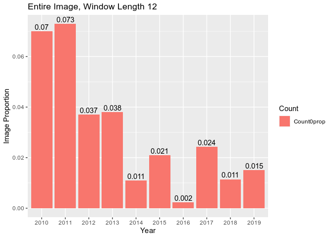
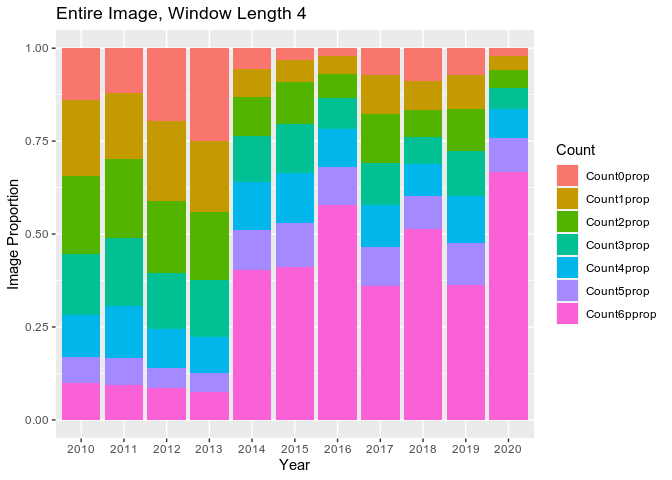
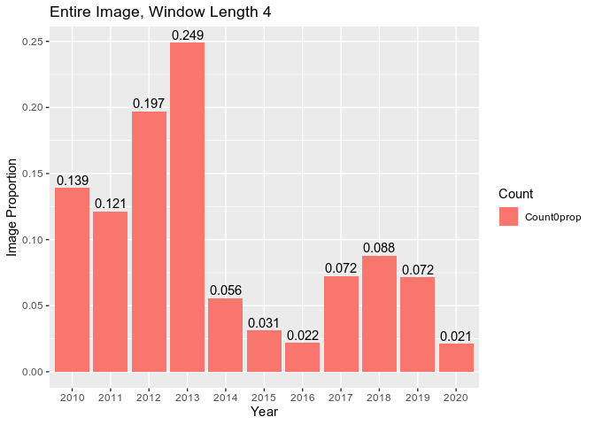
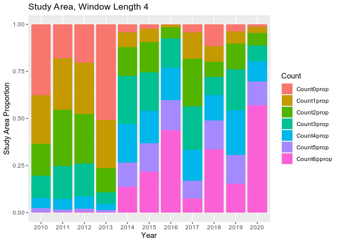
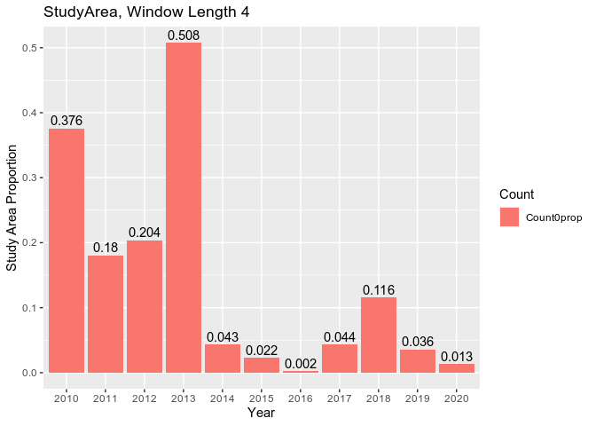
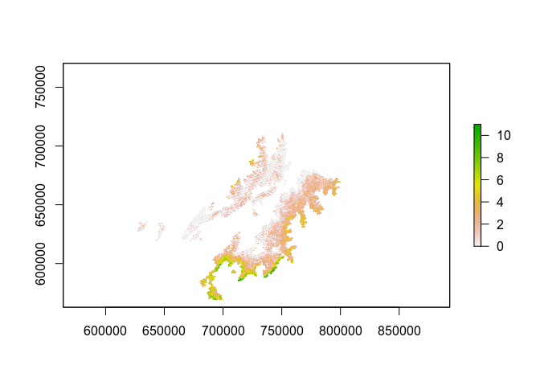

LandTrendr-Paramo Clear Image Analysis
================
James Millington
2020-06-10

  - [Rationale](#rationale)
  - [Data](#data)
      - [Visualise Examples of the
        Data](#visualise-examples-of-the-data)
      - [Create Data Summary](#create-data-summary)
      - [Initial Summary Visualization](#initial-summary-visualization)
  - [Multi-Year January
    Visualisation](#multi-year-january-visualisation)
      - [Thoughts 2020-06-07](#thoughts-2020-06-07)
  - [Pixel-by-Pixel analysis](#pixel-by-pixel-analysis)
      - [Annual Cloud Counts](#annual-cloud-counts)
      - [Sequences of Counts](#sequences-of-counts)
      - [Thoughts 2020-06-10](#thoughts-2020-06-10)

## Rationale

Our Paramo study region is characterised by high cloud cover. LandTrendR
requires that we specify a window of time during a year to analyse
images for change detection. Previous papers have recommended the window
should correspond with the growing season. However, our study area is in
the tropics with no clearly defined growing season. Furthermore, with
high levels of cloud cover we may not be able to limit ourselves to the
most physically-appropriate window from the perspective ofchange
detection.

Here we examine how long the window needs to be to maximise the number
of cloud-free pixels. We want a window as short as possible to detect
change, but longer window will allow greater probability of cloud-free
pixels.

Ultimately we can compare three window lengths:

1.  current best based on physical properties (Jan-Apr, because
    anecdotally this is the anthro fire season)
2.  entire year-long window
3.  trade-off window between the 1. and 2. (most pixels for shortest
    window)

Identifying the length of window 3. demands examining the number of
cloud free pixels in windows of varying length. *Question: do these
windows always need to start from Jan or could they start later in the
year?*

## Data

There data are for 2010-2019 with the following file-naming convention:

  - ClearMon0 is 2010
  - ClearMon5 is 2015

### Visualise Examples of the Data

``` r
library(raster)

dat1 <- raster("Data/ClearImages/ClearJan0.tif")
dat2 <- raster("Data/ClearImages/ClearFeb0.tif")

st <- stack(dat1,dat2)
sd <- sum(st)

plot(dat1, main="Image1")
```

<!-- -->

``` r
plot(dat2, main = "Image2")
```

<!-- -->

``` r
plot(sd, main="Sum")
```

<!-- --> \#\#\#
Check masking

First, read shp and check it aligns with raster

``` r
library(sf)
GISpath <- "/home/james/OneDrive/Research/Projects/ColombiaBIO/Fire/Fire GIS Files/" #linux
#GISpath <- "E:/OneDrive - King's College London/Research/Projects/ColombiaBIO/Fire/Fire GIS Files/"  #windows

buf <- st_read(paste0(GISpath,"500mbufferOfComplejos/GroundTruthingBuffer500m.shp"))
```

    ## Reading layer `GroundTruthingBuffer500m' from data source `/home/james/OneDrive/Research/Projects/ColombiaBIO/Fire/Fire GIS Files/500mbufferOfComplejos/GroundTruthingBuffer500m.shp' using driver `ESRI Shapefile'
    ## Simple feature collection with 17 features and 11 fields
    ## geometry type:  POLYGON
    ## dimension:      XY
    ## bbox:           xmin: 1024933 ymin: 1060489 xmax: 1197690 ymax: 1202938
    ## CRS:            3116

``` r
#set crs of shp to same as for raster
buf <- st_transform(buf, "+proj=utm +zone=18 +datum=WGS84 +units=m +no_defs +ellps=WGS84 +towgs84=0,0,0")

#check 
plot(sd)
plot(st_geometry(buf), add=T)
```

<!-- -->

Now rasterise the buffer shp and use this as a mask

``` r
buf_r <- rasterize(buf, sd, field=1)
sd_b <- mask(sd, buf)

plot(buf_r)
```

<!-- -->

``` r
plot(sd_b)
```

<!-- -->

``` r
print(freq(sd_b))
```

    ##       value    count
    ##  [1,]     0  2561591
    ##  [2,]     1  1842221
    ##  [3,]     2   954852
    ##  [4,]     3   312556
    ##  [5,]     4    45079
    ##  [6,]     5     3499
    ##  [7,]     6       68
    ##  [8,]     7       11
    ##  [9,]    NA 48747443

We can check the number of cells in the masked raster (compared to the
original image0

``` r
print(paste0("Cells in mask: ", cellStats(buf_r, sum)))
```

    ## [1] "Cells in mask: 5719877"

``` r
print(paste0("Cells in original: ", ncell(buf_r)))
```

    ## [1] "Cells in original: 54467320"

Save the raster to file for use elsewhere:

``` r
writeRaster(buf_r, paste0(GISpath,"500mbufferOfComplejos/GroundTruthingBuffer500m_mask.tif"))
```

### Create Data Summary

The following script generates summary counts of cloud-free pixels for
Paramo, examining different windows of time. Summary is by Year,
StartMonth and WindowLength and output is counts of pixels with
0,1,2,3,4,5,6+ cloud free images in a given window. The output data file
(csv) is window-per-line. See further comments in the code.

As this script takes a while to run, it is presented here for
completeness, but best run using ClearImages.r independently.

``` r
library(raster)
library(tidyverse)
library(RColorBrewer)
library(sf)

#####
#FUNCTIONS

#function to create image filename from year and month values
imageFilename <- function(yr,mon){
  
  y = yr %% 2010
  m = month.abb[mon]    #month.abb is built-in 
  fn = paste0("Clear",m,y,".tif")
  #print(fn)
  return(fn)
  
}

#function to add data for this window to the summary data tibble 
appendClearData <- function(cDt, yr, ws, wl, counts, lf){
  
  #set count variables from the frequency table
  zeros <- ones <- twos <- threes <- fours <- fives <- sixplus <- 0
  zeros <- counts[1,2]
  if(lf > 1) ones <- counts[2,2]
  if(lf > 2) twos <- counts[3,2]
  if(lf > 3) threes <- counts[4,2]
  if(lf > 4) fours <- counts[5,2]
  if(lf > 5) fives <- counts[6,2]
  if(lf > 6) sixplus <- sum(counts[7:lf,2])
  
  #append data to tibble
  cDt <- cDt %>% add_row(tibble_row(
    Year = yr,
    WindowStart = ws,
    WindowLen  = wl, 
    Count0 = zeros,
    Count1 = ones,
    Count2 = twos,
    Count3 = threes,
    Count4 = fours,
    Count5 = fives,
    Count6p = sixplus),
    Max = lf-1)
  
  #return tibble (overwrite)
  return(cDt)
}

#function to write raster to png
rasPNG <- function(ras, yr, mons) {
  
  png(filename=paste0(path,"ClearImagesTotals_",yr,"_",month.abb[head(mons,1)],"-",month.abb[tail(mons,1)],".png"))
  
  #first plot without legend
  plot(ras, breaks=mycuts, col=mypal(length(mycuts)), legend=FALSE, main=paste0(yr," ",month.abb[head(mons,1)],"-",month.abb[tail(mons,1)]))
  legend("right", legend=as.character(mycuts),fill=mypal(length(mycuts)))   #add custom legend
  plot(st_geometry(buf), border="red",add=T) #add paramo buffer area
  
  dev.off()
}


#####
#INPUTS
Years <- seq(2019,2019,1)   #list of Years to analyse
StartMonth <- seq(1,1,1)  #list of StartMonths to analyse (1 is Jan, 12 is Dec)
path <- "Data/ClearImages/" #path to data directory

#structure for output summary data
clearData_image <- tibble(
  Year = numeric(),         #year this window is in
  WindowStart = numeric(),  #month in which the window starts
  WindowLen = numeric(),    #number of months in this window
  Count0 = numeric(),       #count of pixels with 0 cloud free images
  Count1 = numeric(),       #... 1 cloud free image
  Count2 = numeric(),       #... 2 cloud free images
  Count3 = numeric(),       #... 3 cloud free images
  Count4 = numeric(),       #... 4 cloud free images
  Count5 = numeric(),       #... 5 cloud free images
  Count6p = numeric(),      #count of pixels with 6 OR MORE cloud free images
  Max = numeric()           #max number of cloud free images in this window (should be equivalent to total number of images in the window)
)

clearData_mask <- clearData_image

#read mask data 
#GISpath <- "/home/james/OneDrive/Research/Projects/ColombiaBIO/Fire/Fire GIS Files/" #linux
GISpath <- "E:/OneDrive - King's College London/Research/Projects/ColombiaBIO/Fire/Fire GIS Files/"  #windows
  
buf <- st_read(paste0(GISpath,"500mbufferOfComplejos/GroundTruthingBuffer500m.shp"))
buf <- st_transform(buf, "+proj=utm +zone=18 +datum=WGS84 +units=m +no_defs +ellps=WGS84 +towgs84=0,0,0")
buf_r <- raster(paste0(GISpath,"500mbufferOfComplejos/GroundTruthingBuffer500m_mask.tif"))

#plotting parms
mycuts <- c(0,1,2,3,4,5,6,100)
mypal <- colorRampPalette(c("white","black"))


#####
#ANALYSIS
for(i in Years){
  print(paste0("Year: ",i))  #loop on years of analysis
  
  for(j in StartMonth){
    print(paste0("Start Mon: ",month.abb[j]))  #loop on StartMonth of analysis
    
    max_wl = 13 - j   #max window length possible for this StartMonth (12 for Jan, 11 for Feb, ... 1 for Dec)
    Lengths <- seq(from=1,to=max_wl,by=1)   #create a list of possible window lengths for next loop
    
    for(k in Lengths){  #loop on possible Window Lengths for this StartMonth
      print(paste0("Window Length: ",k))
      
      
      ##MEMORY MANAGEMENT see https://r-forge.r-project.org/forum/forum.php?thread_id=30946&forum_id=995&group_id=302
      raster_tmp_dir <- "raster_tmp"  ## define the name of a temp directory where raster tmp files will be stored
      dir.create(raster_tmp_dir, showWarnings = F, recursive = T)  ## create the directory
      rasterOptions(tmpdir = raster_tmp_dir)  ## set raster options
      ##
      
      Months <- seq(from=j,length.out=k)  #create list of months for this StartMonth-WindowLength (j-k) combo 
      images <- stack()   #empty stack to hold rasters read in next loop
      
      #create the stack of rasters for this window length
      #loop through months in the StartMonth-WindowLength combo
      for(l in Months){
        ras <- raster(paste0(path,imageFilename(yr=i,mon=l)))  #read raster
        images <- stack(images, ras)  #add to stack
      }
      
      images_mask <- mask(images,buf_r) #apply mask to the stack
      
      freqs <- 0  #create dummy object for frequencies from images
      freqs_mask <- 0 #create dummy object for frequencies from masked images
      
      if(k > 1) { 
        totals <- sum(images)   #if more than one image in the window, calc sum of all images in the stack
        freqs <- freq(totals)   #then calc freq on the sum 
        
        totals_mask <- sum(images_mask)    #if more than one image in the window, calc sum of all images in the stack
        freqs_mask <- freq(totals_mask)    #then calc freq on the sum 
        
        #if StartMonth is Jan, output .tif of cell sums (write full image only, can mask this later if needed in subsequent analysis)
        if(j==1) writeRaster(totals, filename=paste0(path,"ClearImagesTotals_",i,"_",month.abb[head(Months,1)],"-",month.abb[tail(Months,1)],".tif"),datatype="INT2S")
        rasPNG(ras=totals,yr=i, mons=Months)    #always write png 
        
      
      } else {
        freqs <- freq(images,merge=T)             #else, only one image in the stack, calc freq on this using merge=T
        freqs_mask <- freq(images_mask,merge=T)   #else, only one image in the stack, calc freq on this using merge=T
        
        #if StartMonth is Jan, output raster of cell sums (write full image only, can mask this later if needed in subsequent analysis)
        if(j==1) writeRaster(images, filename=paste0(path,"ClearImagesTotals_",i,"_",month.abb[head(Months,1)],"-",month.abb[tail(Months,1)],".tif"),datatype="INT2S")
        rasPNG(ras=images,yr=i, mons=Months)      #always write png 
        
      }

      lenfreq <- length(freqs[,1])  #returns max count + 1
      lenfreq_mask <- length(freqs_mask[,1])  #returns max count + 1
      
      #add data for this window start-length combo to the summary data table
      clearData_image <- appendClearData(cDt=clearData_image,yr=i, ws=j, wl=k, counts=freqs,lf=lenfreq)
      clearData_mask <- appendClearData(cDt=clearData_mask,yr=i, ws=j, wl=k, counts=freqs_mask,lf=lenfreq_mask)

      ## remove the tmp dir
      unlink(raster_tmp_dir, recursive = T, force = T)
      
    }  #end [Window] Lengths loop
  }  #end StartMonth loop
}  #end Years loop

#output summary data tables
write_csv(x=clearData_image,
          path=paste0(path,"ClearImages_ImageSummary_",head(Years,1),"-",tail(Years,1),"_",month.abb[head(StartMonth,1)],"-",month.abb[tail(StartMonth,1)],".csv"))

write_csv(x=clearData_mask,
          path=paste0(path,"ClearImages_MaskSummary_",head(Years,1),"-",tail(Years,1),"_",month.abb[head(StartMonth,1)],"-",month.abb[tail(StartMonth,1)],".csv"))
```

### Initial Summary Visualization

``` r
library(tidyverse)
path <- "Data/ClearImages/" #path to data directory
dat <- read_csv(paste0(path,"ClearImagesSummary_2010-2011_Jan-Dec.csv"))
```

``` r
#plot count0 against window length (group by year, windows starting from Jan)

dat %>%
  filter(WindowStart == 1 & Year < 2012) %>%
  mutate(across(matches("Year"),as.factor)) %>%
  mutate(across(matches("WindowLen"),as.factor)) %>%
  ggplot(aes(x=WindowLen, y=Count0, fill=Year)) +
  geom_bar(stat="identity", position=position_dodge()) +
  scale_y_continuous(name="Non-Cloud Free (count pixels)", labels = scales::comma) +
  ggtitle("All Windows Start in Jan")
```

<!-- -->

``` r
dat %>%
  filter(WindowStart == 1 & Year < 2012) %>%
  mutate(across(matches("Year"),as.factor)) %>%
  mutate(across(matches("WindowLen"),as.factor)) %>%
  ggplot(aes(x=WindowLen, y=Count0)) +
  geom_bar(stat="identity", position=position_dodge()) +
  facet_grid(.~Year) +
  scale_y_continuous(name="Non-Cloud Free (count pixels)", labels = scales::comma) +
  ggtitle("All Windows Start in Jan")
```

<!-- -->

In next plot, `Count0` is count of pixels that are not cloud free in the
window, `Count1` is count of pixels that have one cloud free image in
the window… etc. to `Count6p` which is count of pixels with 6 or more
cloud free images in the window.

``` r
total_cells <- ncell(dat2)

countprop <- function(num) { num/total_cells } #function to calc prop count of total image size, e.g. https://stackoverflow.com/a/49759987

dat %>%
  filter(WindowStart == 1 & Year < 2012) %>%
  mutate(across(matches("Year"),as.factor)) %>%
  mutate(across(matches("WindowLen"),as.factor)) %>%
  mutate(across(starts_with("Count"), countprop, .names="{col}prop")) %>%  #create proportion columns
  dplyr::select(c(Year,starts_with("Window") | ends_with("prop"))) %>%
  pivot_longer(cols=ends_with("prop"),names_to="Count",values_to="prop") %>%
  ggplot(aes(x=WindowLen, y=prop, fill=Count)) +
  geom_bar(stat="identity",position="fill") +
  facet_grid(.~Year) +
  scale_y_continuous(name="Image Proportion") +
  ggtitle("All Windows Start in Jan")
```

<!-- -->

``` r
#plot count0 (point size) by window length (y) and StartMonth (x) 

dat %>%
  filter(Year < 2012) %>%
  mutate(across(matches("Year"),as.factor)) %>%
  mutate(across(matches("WindowLen"),as.factor)) %>%
  mutate(across(matches("WindowStart"),as.factor)) %>%
  ggplot(aes(x=WindowLen, y=WindowStart, size=Count0)) +
  #scale_color_gradient(low="yellow", high="red") + 
  geom_point(shape=15) + 
  scale_y_discrete(labels=month.abb) +
  facet_grid(.~Year) + 
  ggtitle("Non-Cloud Free")
```

<!-- -->

## Multi-Year January Visualisation

As windows starting in January seem to consistently have the greatest
cloud-free pixels, let’s focus on that now after having run the script
for widows starting only in January and for both entire image and masked
to study area. Furthermore, data above show that:

  - entire year windws (i.e. WindowLength == 12) have greatest
    cloud-free images
  - there is rapid increase in number of cloud-free pixels until
    WindowLength == 5 when improvements slow.

So, let’s focus here on WindowLengths of 12 and 4

``` r
#load data
path <- "Data/ClearImages/" #path to data directory
dat_Jan_1020 <- read_csv(paste0(path,"ClearImages_ImageSummary_2010-2020_Jan-Jan.csv"))
dat_Jan_1020_mask <- read_csv(paste0(path,"ClearImages_MaskSummary_2010-2020_Jan-Jan.csv"))
```

**Entire Image, Window Length 12**

``` r
total_cells <- ncell(buf_r)

countprop <- function(num) { num/total_cells } #function to calc prop count e.g. https://stackoverflow.com/a/49759987

dat_Jan_1020 %>%
  filter(WindowLen == 12) %>%
  filter(Year < 2020) %>%    #we do not have entire year for 2020
  mutate(across(matches("Year"),as.factor)) %>%
  mutate(across(matches("WindowLen"),as.factor)) %>%
  mutate(across(starts_with("Count"), countprop, .names="{col}prop")) %>%  #create proportion columns
  dplyr::select(c(Year,starts_with("Window") | ends_with("prop"))) %>%
  pivot_longer(cols=ends_with("prop"),names_to="Count",values_to="prop") %>%
  ggplot(aes(x=Year, y=prop, fill=Count)) +
  geom_bar(stat="identity",position="fill") +
  #facet_grid(.~Year) +
  scale_y_continuous(name="Image Proportion") +
  ggtitle("Entire Image, Window Length 12")  
```

<!-- -->

``` r
dat_Jan_1020 %>%
  filter(WindowLen == 12) %>%
  filter(Year < 2020) %>%    #we do not have entire year for 2020
  mutate(across(matches("Year"),as.factor)) %>%
  mutate(across(matches("WindowLen"),as.factor)) %>%
  mutate(across(starts_with("Count"), countprop, .names="{col}prop")) %>%  #create proportion columns
  dplyr::select(c(Year,Count0prop,starts_with("Window"))) %>% 
  pivot_longer(cols=ends_with("prop"),names_to="Count",values_to="prop") %>% 
  ggplot(aes(x=Year, y=prop, fill=Count)) +
  geom_bar(stat="identity") +
  #facet_grid(.~Year) +
  scale_y_continuous(name="Image Proportion") +
  ggtitle("Entire Image, Window Length 12") +
  geom_text(aes(label=round(prop,3),x=Year,y=prop), position=position_dodge(width=0.8), vjust=-0.3)
```

<!-- -->

So, in 2016 we have a full-year window with almost 100% cloud-free
images, but in 2010 and 2011 we have \~7% of pixels with no cloud-free
image.

 

**Entire Image, Window Length 4**

``` r
total_cells <- ncell(buf_r)

countprop <- function(num) { num/total_cells } #function to calc prop count e.g. https://stackoverflow.com/a/49759987

dat_Jan_1020 %>%
  filter(WindowLen == 4) %>%
  mutate(across(matches("Year"),as.factor)) %>%
  mutate(across(matches("WindowLen"),as.factor)) %>%
  mutate(across(starts_with("Count"), countprop, .names="{col}prop")) %>%  #create proportion columns
  dplyr::select(c(Year,starts_with("Window") | ends_with("prop"))) %>%
  pivot_longer(cols=ends_with("prop"),names_to="Count",values_to="prop") %>%
  ggplot(aes(x=Year, y=prop, fill=Count)) +
  geom_bar(stat="identity",position="fill") +
  #facet_grid(.~Year) +
  scale_y_continuous(name="Image Proportion") +
  ggtitle("Entire Image, Window Length 4")  
```

<!-- -->

``` r
dat_Jan_1020 %>%
  filter(WindowLen == 4) %>%
  mutate(across(matches("Year"),as.factor)) %>%
  mutate(across(matches("WindowLen"),as.factor)) %>%
  mutate(across(starts_with("Count"), countprop, .names="{col}prop")) %>%  #create proportion columns
  dplyr::select(c(Year,Count0prop,starts_with("Window"))) %>% 
  pivot_longer(cols=ends_with("prop"),names_to="Count",values_to="prop") %>% 
  ggplot(aes(x=Year, y=prop, fill=Count)) +
  geom_bar(stat="identity") +
  #facet_grid(.~Year) +
  scale_y_continuous(name="Image Proportion") +
  ggtitle("Entire Image, Window Length 4") +
  geom_text(aes(label=round(prop,3),x=Year,y=prop), position=position_dodge(width=0.8), vjust=-0.3)
```

<!-- -->

When we look at a window length of 4 months (starting in Jan) for the
entire image, we see earlier years have upto 25% pixels are not
cloud-free (e.g. 2013), although again 2016 is quite clear.

 

**Study Area, Window Length 12**

``` r
total_cells <- cellStats(buf_r, sum)

countprop <- function(num) { num/total_cells } #function to calc prop count e.g. https://stackoverflow.com/a/49759987

dat_Jan_1020_mask %>%
  filter(WindowLen == 12) %>%
  filter(Year < 2020) %>%    #we do not have entire year for 2020
  mutate(across(matches("Year"),as.factor)) %>%
  mutate(across(matches("WindowLen"),as.factor)) %>%
  mutate(Count6p = 5719877 - (Count0 + Count1 + Count2 + Count3 + Count4 + Count5)) %>%   #fix count6p cells (mask summary didn't work properly in early version (number is cells in study area minus other classes)
  mutate(across(starts_with("Count"), countprop, .names="{col}prop")) %>%  #create proportion columns
  dplyr::select(c(Year,starts_with("Window") | ends_with("prop"))) %>%
  pivot_longer(cols=ends_with("prop"),names_to="Count",values_to="prop") %>%
  ggplot(aes(x=Year, y=prop, fill=Count)) +
  geom_bar(stat="identity",position="fill") +
  #facet_grid(.~Year) +
  scale_y_continuous(name="Study Area Proportion") +
  ggtitle("Study Area, Window Length 12")  
```

<!-- -->

``` r
dat_Jan_1020_mask %>%
  filter(WindowLen == 12) %>%
  filter(Year < 2020) %>%    #we do not have entire year for 2020
  mutate(across(matches("Year"),as.factor)) %>%
  mutate(across(matches("WindowLen"),as.factor)) %>%
    mutate(Count6p = 5719877 - (Count0 + Count1 + Count2 + Count3 + Count4 + Count5)) %>%   #fix count6p cells (mask summary didn't work properly in early version (number is cells in study area minus other classes)
  mutate(across(starts_with("Count"), countprop, .names="{col}prop")) %>%  #create proportion columns
  dplyr::select(c(Year,Count0prop,starts_with("Window"))) %>% 
  pivot_longer(cols=ends_with("prop"),names_to="Count",values_to="prop") %>% 
  ggplot(aes(x=Year, y=prop, fill=Count)) +
  geom_bar(stat="identity") +
  #facet_grid(.~Year) +
  scale_y_continuous(name="Study Area Proportion") +
  ggtitle("StudyArea, Window Length 12") +
  geom_text(aes(label=round(prop,3),x=Year,y=prop), position=position_dodge(width=0.8), vjust=-0.3)
```

<!-- -->

Considering the study area only (for a 12 month window), we find that
this is generally more cloudy in early year, but not so bad from 2014
onwards.


**Study Area, Window Length 4**

``` r
total_cells <- cellStats(buf_r, sum)

countprop <- function(num) { num/total_cells } #function to calc prop count e.g. https://stackoverflow.com/a/49759987

dat_Jan_1020_mask %>%
  filter(WindowLen == 4) %>%
  mutate(across(matches("Year"),as.factor)) %>%
  mutate(across(matches("WindowLen"),as.factor)) %>%
  mutate(Count6p = 5719877 - (Count0 + Count1 + Count2 + Count3 + Count4 + Count5)) %>%   #fix count6p cells (mask summary didn't work properly in early version (number is cells in study area minus other classes)
  mutate(across(starts_with("Count"), countprop, .names="{col}prop")) %>%  #create proportion columns
  dplyr::select(c(Year,starts_with("Window") | ends_with("prop"))) %>%
  pivot_longer(cols=ends_with("prop"),names_to="Count",values_to="prop") %>%
  ggplot(aes(x=Year, y=prop, fill=Count)) +
  geom_bar(stat="identity",position="fill") +
  #facet_grid(.~Year) +
  scale_y_continuous(name="Study Area Proportion") +
  ggtitle("Study Area, Window Length 4")  
```

<!-- -->

``` r
dat_Jan_1020_mask %>%
  filter(WindowLen == 4) %>%
  mutate(across(matches("Year"),as.factor)) %>%
  mutate(across(matches("WindowLen"),as.factor)) %>%
    mutate(Count6p = 5719877 - (Count0 + Count1 + Count2 + Count3 + Count4 + Count5)) %>%   #fix count6p cells (mask summary didn't work properly in early version (number is cells in study area minus other classes)
  mutate(across(starts_with("Count"), countprop, .names="{col}prop")) %>%  #create proportion columns
  dplyr::select(c(Year,Count0prop,starts_with("Window"))) %>% 
  pivot_longer(cols=ends_with("prop"),names_to="Count",values_to="prop") %>% 
  ggplot(aes(x=Year, y=prop, fill=Count)) +
  geom_bar(stat="identity") +
  #facet_grid(.~Year) +
  scale_y_continuous(name="Study Area Proportion") +
  ggtitle("StudyArea, Window Length 4") +
  geom_text(aes(label=round(prop,3),x=Year,y=prop), position=position_dodge(width=0.8), vjust=-0.3)
```

<!-- -->

It’s a similar issue when we look at 4 month window for the study area,
but 2013 is particularly bad with more than half of pixels having no
cloud-free image.

### Thoughts 2020-06-07

  - Entire year gives more cloud-free pixels
  - Study area with Jan-Apr windows will lose a lot of data for years
    prior to 2014
  - Study area with Jan-Dec window looks feasible for analysis for 2012
    onwardS
  - Why is 2014 onwards so much more cloud free? Was a new Landsat
    sensor added? Some re-calibration?

Next step in analysis is to identify proportion of pixels in the study
area with \>1 consecutive years with no cloud-free image? i.e. Pixels
with one year missing here-or-there could be included in LandTrendR
analyses, but pixels with multi-years of missing data should be ommited
from the analysis?

What other analyses?

## Pixel-by-Pixel analysis

### Annual Cloud Counts

First, lets do some relatively simple counts of the number of years for
which pixels are (non)cloud-free. We can plot maps and histograms and
generate frequency tables.

Some functions that will be useful:

``` r
#function to sum number of years with no cloud free image (given a window of months)
#output is  raster  of counts
annualCloudCount <- function(yrs, mons, pixrcl, studyras){

  yrstack <- stack()  
  
  for(i in yrs){
    
    print(paste0("Year: ", i))
  
    iras <- raster(paste0(path,"ClearImagesTotals_",i,"_",mons,".tif"))  #read annual tif files
    
    iras <- mask(iras,studyras) #mask to study area
    
    rcras <- reclassify(iras, pixrcl)  #reclassify (0 is cloud-free, 1 is not clear)
    
    yrstack <- stack(yrstack, rcras)  #add to stack
  }
  
  missing <- sum(yrstack)

  return(missing)
}

#function to take output raster from annualCloudCount and create a summary tibble
aCC_summary <- function(ras){
  
  counts <- freq(ras, useNA='no')
  
  freqs <- as_tibble(counts)
  freqs <- freqs %>%
    mutate(cumcount = cumsum(count)) %>%
    mutate(prop = round(count / sum(count),3)) %>%
    mutate(cumprop = round(cumcount / sum(count),3))
  
  return(freqs)
}

setRasterTmp <- function(raster_tmp_dir){
  ##MEMORY MANAGEMENT see https://r-forge.r-project.org/forum/forum.php?thread_id=30946&forum_id=995&group_id=302
  dir.create(raster_tmp_dir, showWarnings = F, recursive = T)  ## create the directory
  rasterOptions(tmpdir = raster_tmp_dir)  ## set raster options
  ##
}

delRasterTmp <- function(raster_tmp_dir){
  ## remove the tmp dir
  unlink(raster_tmp_dir, recursive = T, force = T)
}


createBinPixrcl <- function(limit, lower1){
  
  if(lower1){
    rcl0 <- c(-Inf,limit,1)  #>from, <=to, becomes
    rcl1 <- c(limit,Inf,0)  
  } else {
    rcl0 <- c(-Inf,limit,0)  #>from, <=to, becomes
    rcl1 <- c(limit,Inf,1)  
  }
  
  pixrcl <- rbind(rcl0,rcl1)
  
  return(pixrcl)
}
```

**Four Month Window**

Only run the next code chunk once (to create the .tif)

``` r
Years <- seq(2010,2020,1)
Months <- "Jan-Apr"

cloudrcl0 <- createBinPixrcl(limit=0, lower1=T) #sets original 0 value to 0 and everything >0 to 1. Do this because in input tif 0 indicates no cloud-free images, so code 1 here as we want to count these 

setRasterTmp("raster_temp")
JanApr_1020 <- annualCloudCount(Years, Months, cloudrcl0, buf_r)
writeRaster(JanApr_1020, filename=paste0(path,"annualCloudCount_2010-2020_Jan-Apr.tif"),datatype="INT2S",overwrite=T)
delRasterTmp("raster_temp")
```

Now plot and generate frequency table

``` r
JanApr_1020 <- raster(x=paste0(path,"annualCloudCount_2010-2020_Jan-Apr.tif"))
JanApr_1020_sum <- aCC_summary(JanApr_1020)

plot(JanApr_1020)
```

<!-- -->

This map shows the number of years each pixel has missing data. We see
greatest values (greens) in east and south. Some cells have no clear
pixels across the entire 10 year period.

``` r
print(JanApr_1020_sum)
```

    ## # A tibble: 12 x 5
    ##    value   count cumcount  prop cumprop
    ##    <dbl>   <dbl>    <dbl> <dbl>   <dbl>
    ##  1     0 2025161  2025161 0.354   0.354
    ##  2     1 1446358  3471519 0.253   0.607
    ##  3     2 1050048  4521567 0.184   0.791
    ##  4     3  478046  4999613 0.084   0.874
    ##  5     4  273362  5272975 0.048   0.922
    ##  6     5  188992  5461967 0.033   0.955
    ##  7     6  107177  5569144 0.019   0.974
    ##  8     7   75731  5644875 0.013   0.987
    ##  9     8   45206  5690081 0.008   0.995
    ## 10     9   23166  5713247 0.004   0.999
    ## 11    10    5360  5718607 0.001   1    
    ## 12    11    1270  5719877 0       1

From the table we can 87.4% of the study area has pixels with 3 or fewer
missing years (and 92.2% with 4 or fewer).

We likely need to discard the 7.8% of pixels with \>4 missing years?

Let’s quickly plot a map of location of pixels with \>4 missing years

``` r
cloudrcl4 <- createBinPixrcl(limit=4, lower1=F)  #sets original <=4 value to 1 and everything >4 to 0.

missing_bin <- reclassify(JanApr_1020, cloudrcl4) 

plot(missing_bin)
```

<!-- -->

Now it seems the main issue is in south, but still with some area in the
east.

**Full year**

Now let’s do the same analyses but using the entire year window.

``` r
Years <- seq(2010,2019,1)
Months <- "Jan-Dec"

cloudrcl0 <- createBinPixrcl(limit=0, lower1=T) #sets original 0 value to 0 and everything >0 to 1. Do this because in input tif 0 indicates no cloud-free images, so code 1 here as we want to count these 

setRasterTmp("raster_temp")
JanDec_1019 <- annualCloudCount(Years, Months, cloudrcl0, buf_r)
```

    ## [1] "Year: 2010"
    ## [1] "Year: 2011"
    ## [1] "Year: 2012"
    ## [1] "Year: 2013"
    ## [1] "Year: 2014"
    ## [1] "Year: 2015"
    ## [1] "Year: 2016"
    ## [1] "Year: 2017"
    ## [1] "Year: 2018"
    ## [1] "Year: 2019"

``` r
writeRaster(JanDec_1019, filename=paste0(path,"annualCloudCount_2010-2019_Jan-Dec.tif"),datatype="INT2S",overwrite=T)
delRasterTmp("raster_temp")
```

``` r
JanDec_1019 <- raster(x=paste0(path,"annualCloudCount_2010-2019_Jan-Dec.tif"))
JanDec_1019_sum <- aCC_summary(JanDec_1019)

plot(JanDec_1019)
```

<!-- -->

Now we see a maximum of 8 missing years, again in the south of the study
area.

``` r
print(JanDec_1019_sum)
```

    ## # A tibble: 10 x 5
    ##    value   count cumcount  prop cumprop
    ##    <dbl>   <dbl>    <dbl> <dbl>   <dbl>
    ##  1     0 3809083  3809083 0.666   0.666
    ##  2     1 1180622  4989705 0.206   0.872
    ##  3     2  357796  5347501 0.063   0.935
    ##  4     3  176587  5524088 0.031   0.966
    ##  5     4   98519  5622607 0.017   0.983
    ##  6     5   54768  5677375 0.01    0.993
    ##  7     6   27620  5704995 0.005   0.997
    ##  8     7   12251  5717246 0.002   1    
    ##  9     8    2382  5719628 0       1    
    ## 10     9     249  5719877 0       1

And we see higher counts/proportions for years with \<=3 cloudy years
(96.6% vs 87.4% using four-month window) and \<=4 cloudy years (98.3% vs
92.2% using four-month window)

Let’s do another quick plot a map of location of pixels with \>4 missing
years

``` r
cloudrcl4 <- createBinPixrcl(limit=4, lower1=F)  #sets original <=4 value to 1 and everything >4 to 0.

missing_bin <- reclassify(JanDec_1019, cloudrcl4) 

plot(missing_bin)
```

<!-- -->

Once again we can see that the main issue is in the south of the study
area, but now with many fewer issues in east.

### Sequences of Counts

The analysis above was couning the number of years with missing data,
regardless of which years during the 10 year study period were missing.
So let’s consider the number of pixels with sequences of consecutive
years of missing data.

First create binary .tifs per year (and months windows); 1 will indicate
no cloud free data (i.e. missing data), 0 indicates cloud free in the
window.

``` r
#function to read, reclass, mask, write Raster
rrmwRas <- function(yr, mons, pixrcl, studyras, dpath){
  
  fpath <- paste0(dpath,"ClearImagesTotals_",yr,"_",mons,".tif")
  
  ras1 <- raster(fpath)  #read annual tif files
  ras1 <- reclassify(ras1, pixrcl)  #reclassify 
  ras1 <- mask(ras1,studyras) #mask to study area
  
  png(filename=paste0(path,"CloudImagesBinary_",yr,"_",mons,".png"))
  plot(ras1, main=paste0(yr," ",mons))
  dev.off()
  
  writeRaster(ras1, filename=paste0(path,"CloudImagesBinary_",yr,"_",mons,".tif"),datatype="INT2S",overwrite=T)

  #plot(ras1)
  return(ras1)
}

yrs <- seq(2010,2020,1)
Months <- "Jan-Apr"

#TEST THIS NEW FUNCTION
cloudrcl0 <- createBinPixrcl(limit=0, lower1=T) #sets original 0 value to 0 and everything >0 to 1. Do this because in input tif 0 indicates no cloud-free images, so code 1 here as we want to count these 

for(yr in yrs){
  rrmwRas(yr, Months, cloudrcl0, buf_r, path)
}
```

Now use the .tifs creates to count the number of consecutive years with
no cloud-free data.

``` r
#function to add data for this sequence to the summary data tibble 
appendSeqData <- function(cDt, start, end, len, count){

  #append data to tibble
  cDt <- cDt %>% add_row(tibble_row(
  SeqStart = start,         
  SeqEnd = end,  
  SeqLen = len,   
  Count0 = count
  ))
  
  #return tibble (overwrite)
  return(cDt)
}

  
#function to produce counts of pixels with no cloud-free images in sequences 
#requires binary cloud/no cloud .tifs to exist (e.g. from rrmwRas function)
seqCloudCount <- function(yrs, mons, seq_lens){

  #structure for output summary data
  seq_summary <- tibble(
  SeqStart = numeric(),   #year this seq startes
  SeqEnd = numeric(),     #year in which the seq ends
  SeqLen = numeric(),     #number of years in this seq
  Count0 = numeric()      #count of pixels with no cloud-free images in this seq
  )

  #loop on sequence length
  for(seq_len in seq_lens){
    
    print(paste0("Seq length: ", seq_len))
    for(i in seq_along(yrs)){
      
      yrstack <- stack() #reset the stack for this year-seq_len combo
      if(i+(seq_len-1) <= length(yrs)) #if this year is not beyond the maximum year we want to check (or have data for)
      {
        print(paste0("Year: ", yrs[i]))
         
        for(j in i:(i+seq_len-1)){
          
          print(yrs[j])
          yrstack <- stack(yrstack, paste0(path,"CloudImagesBinary_",yrs[j],"_",mons,".tif")) #add this year's binary raster to the stack
        }
        
        missing <- sum(yrstack) #sum stack
        counts = freq(missing, value=seq_len)  #value of seq_len indicates cloud in all years of this sequence
        
        #append data to the data tibble
        seq_summary <- appendSeqData(cDt=seq_summary,start=yrs[i], end=yrs[j], len=seq_len, count=counts)
  
        #write image file
        png(filename=paste0(path,"seqCloudCount_",yrs[i],"-",yrs[j],"_",mons,".png"))
        plot(missing, main=paste0(yrs[i],"-",yrs[j]," ",mons))
        dev.off()
  
        if(yrs[i+(seq_len-1)] == tail(yrs,1)) break   #if this is the final year we can check given the sequence length, break this year loop
      } else print("seq_len longer than remaining yrs")  #error message for if above (implies seq_len > length(yrs)) 
    }
  }
  
  return(seq_summary)  #return the data tibble
}

setRasterTmp("raster_temp")
seq234_1019_JanDec <- seqCloudCount(yrs=seq(2010,2019,1), mons="Jan-Dec", seq_len=seq(2,4,1))
seq234_1020_JanApr <- seqCloudCount(yrs=seq(2010,2020,1), mons="Jan-Apr", seq_len=seq(2,4,1))
delRasterTmp("raster_temp")

write_csv(seq234_1019_JanDec, paste0(path,"seq234_1019_JanDec.csv"))
write_csv(seq234_1020_JanApr, paste0(path,"seq234_1020_JanApr.csv"))
```

``` r
seq234_1019_JanDec <- read_csv(paste0(path,"seq234_1019_JanDec.csv"))
print(seq234_1019_JanDec)
```

    ## # A tibble: 24 x 4
    ##    SeqStart SeqEnd SeqLen Count0
    ##       <dbl>  <dbl>  <dbl>  <dbl>
    ##  1     2010   2011      2 471176
    ##  2     2011   2012      2 174806
    ##  3     2012   2013      2  81305
    ##  4     2013   2014      2   6618
    ##  5     2014   2015      2   6018
    ##  6     2015   2016      2   2603
    ##  7     2016   2017      2   2320
    ##  8     2017   2018      2  67761
    ##  9     2018   2019      2  30759
    ## 10     2010   2012      3 141758
    ## # … with 14 more rows

``` r
maskNcell <- cellStats(buf_r, sum)

seq234_1019_JanDec %>%
  mutate(Prop0 = Count0 / maskNcell) %>%
  mutate(across(starts_with("Seq"),as.factor)) %>%
  ggplot(aes(x=SeqStart, y=Prop0)) +
  geom_bar(stat="identity") +
  scale_y_continuous(name="Study Area Proportion", limits=c(0,0.18)) +
  ggtitle("StudyArea, 2010-2019, Jan-Dec, By sequence length") +
  scale_x_discrete(name ="Sequence Start Year", 
                    breaks=c("2010","2012","2014","2016","2018")) +
  #geom_text(aes(label=round(Prop0,3),x=SeqStart,y=Prop0), position=position_dodge(width=0.8), vjust=-0.3) +
  facet_grid(.~SeqLen)
```

<!-- -->

Using the entire year we can see that 2010 has a big impact on the
proportion of pixels with sequences of \>=2 missing years. Year 2011 and
2012 also have an effect but to much lesser extent.

Compare maps of the locations of these pixels with sequences of missing
data for 2010 vs 2012 vs 2016 (for example; darker green indicates
pixels with 3 or more missing years starting from 2010): 


Now let’s look at the four-month window, Jan-Apr

``` r
seq234_1020_JanApr <- read_csv(paste0(path,"seq234_1020_JanApr.csv"))
print(seq234_1020_JanApr)
```

    ## # A tibble: 27 x 4
    ##    SeqStart SeqEnd SeqLen Count0
    ##       <dbl>  <dbl>  <dbl>  <dbl>
    ##  1     2010   2011      2 697529
    ##  2     2011   2012      2 516305
    ##  3     2012   2013      2 961837
    ##  4     2013   2014      2 241608
    ##  5     2014   2015      2  47155
    ##  6     2015   2016      2   7973
    ##  7     2016   2017      2   9013
    ##  8     2017   2018      2 144952
    ##  9     2018   2019      2 148447
    ## 10     2019   2020      2  34516
    ## # … with 17 more rows

``` r
maskNcell <- cellStats(buf_r, sum)

seq234_1020_JanApr %>%
  mutate(Prop0 = Count0 / maskNcell) %>%
  mutate(across(starts_with("Seq"),as.factor)) %>%
  ggplot(aes(x=SeqStart, y=Prop0)) +
  geom_bar(stat="identity") +
  scale_y_continuous(name="Study Area Proportion", limits=c(0,0.18)) +
  ggtitle("StudyArea, 2010-2020, Jan-Apr, By sequence length") +
  scale_x_discrete(name ="Sequence Start Year", 
                    breaks=c("2010","2012","2014","2016","2018", "2020")) +
  #geom_text(aes(label=round(Prop0,3),x=SeqStart,y=Prop0), position=position_dodge(width=0.8), vjust=-0.3) +
  facet_grid(.~SeqLen)
```

<!-- -->

We see a similar pattern to the all-year window, but with greater
numbers of pixels and a more prolonged effect into 2012.

Examining the maps again: 


### Thoughts 2020-06-10

There is further analysis that can be done, but maybe we can start to
make some decisions:

  - Which window do we use (all-year or four-month)? Or shall we compare
    LandTrendR results for each?
  - Which pixels do we drop from all analyses? Those with missing
    sequences of \>=3 years? Or even \>= 2?
      - If \>=3 years for all-year window we would lose \~2.5% of pixels
        if 2010 included (or \~1% if 2010 dropped). For four-month
        window it would be \~9% if all years used, or down to \~3% if
        2012 onwards used.
      - If \>= 2 years then we lose more pixels. Still \<10% for the
        all-years window (and nearer 3% if 2010 droppped). For the
        four-month window, we could lose \~17% of pixels, unless we drop
        2010-2012.  
  - But also, we likely want to mask any pixels that have \>=3 (or is it
    \>=2) years missing even if not in a consecutive sequence?

Once we have discussed I can work on code to formally identify the
unwanted pixels (currently we have only a visual indicator).
