LandTrendr-Paramo Explore
================
James Millington
2020-02-04

Email from Kris, 2020-01-30

> I’ve rerun what I think should be our baseline settings with the
> results downloadable from
> <https://drive.google.com/open?id=1XQvk_JI8cyTH48elFP8HB4m21VdMKZj5>

> Note there are 6 layers:
> 
> 1.  Year of Disturbance detection (YOD)
> 2.  Magnitude of disturbance
> 3.  Duration of disturbance
> 4.  Pre-disturbance value
> 5.  Rate of spectral change
> 6.  Disturbance signal-to-noise ratio (DSNR)\*

Try loading data (six-layer .tif file)

``` r
library(raster)
```

    ## Loading required package: sp

``` r
dat <- stack("Data/LTGEE20012020.tif")
names(dat)
```

    ## [1] "LTGEE20012020.1" "LTGEE20012020.2" "LTGEE20012020.3" "LTGEE20012020.4"
    ## [5] "LTGEE20012020.5" "LTGEE20012020.6"

``` r
names(dat) <- c("Year", "Magnitude", "Duration", "Pre Value", "Spec Chg", "DSNR")

plot(dat)
```

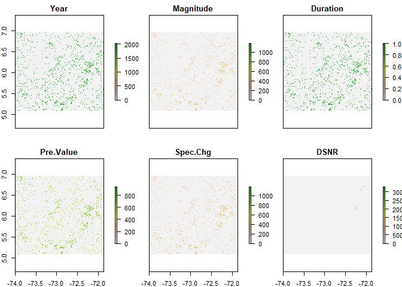<!-- -->

``` r
ncell(dat)
```

    ## [1] 54712119

Looks like NoData has not been indicated (lots of zeros). Should be fine
for first three layers to set NoData = 0. But also, this is a huge
raster. So:

  - subset to first three layers
  - crop to a smaller extent for testing
  - set 0 to NA

<!-- end list -->

``` r
#subset
sdat <- stack(dat[[1]], dat[[2]], dat[[3]])

#cropt
extent(sdat)
```

    ## class      : Extent 
    ## xmin       : -74.00025 
    ## xmax       : -71.87474 
    ## ymin       : 5.090753 
    ## ymax       : 6.960237

``` r
crp <- c(-72.3, -72.25, 5.2, 5.25)
sdat <- crop(sdat, crp)

#0 to NA
NAize <- function(x) { ifelse(x == 0, NA, x) }
sdat <- calc(sdat, fun=NAize)

plot(sdat)
```

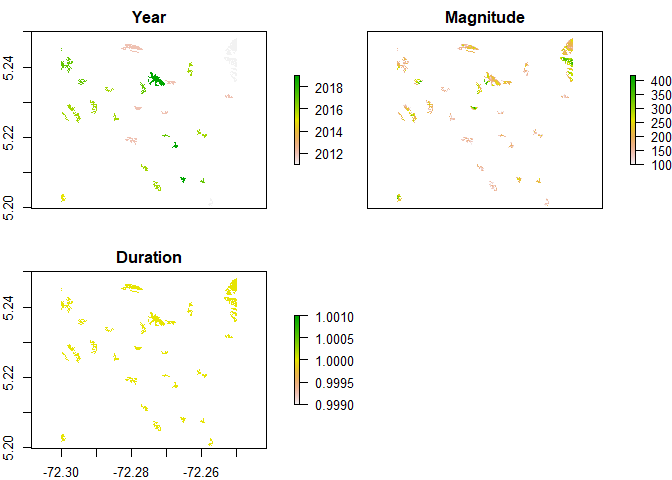<!-- -->

There’s no unique fire ID. Add one using `clump` on `Year` layer:

``` r
IDs <- clump(sdat[["Year"]])
```

    ## Loading required namespace: igraph

``` r
plot(IDs)
```

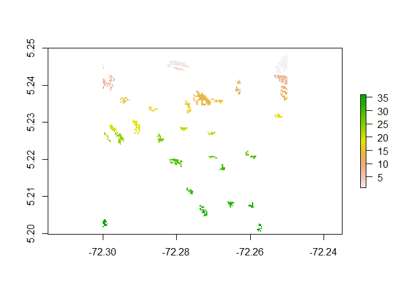<!-- -->

``` r
names(IDs) <- "FireID"

sdat <-stack(sdat, IDs)
plot(sdat)
```

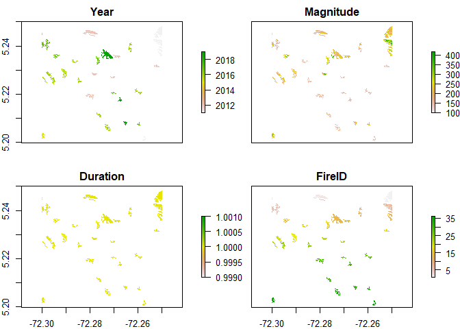<!-- -->

Let’s check if this worked. If so, all patches should have a SD of zero
(because all values within the patch should be identical):

``` r
tab.years.sd <- zonal(x=sdat[["Year"]], z=sdat[["FireID"]], fun='sd')
tab.years.sd
```

    ##       zone        sd
    ##  [1,]    1 0.0000000
    ##  [2,]    2 0.0000000
    ##  [3,]    3        NA
    ##  [4,]    4 0.0000000
    ##  [5,]    5 0.0000000
    ##  [6,]    6 0.0000000
    ##  [7,]    7 0.0000000
    ##  [8,]    8 0.0000000
    ##  [9,]    9 0.0000000
    ## [10,]   10 0.0000000
    ## [11,]   11 0.0000000
    ## [12,]   12 0.0000000
    ## [13,]   13 0.0000000
    ## [14,]   14 0.0000000
    ## [15,]   15 0.0000000
    ## [16,]   16 0.0000000
    ## [17,]   17 0.0000000
    ## [18,]   18 0.0000000
    ## [19,]   19 0.0000000
    ## [20,]   20 0.0000000
    ## [21,]   21 0.0000000
    ## [22,]   22 0.0000000
    ## [23,]   23 0.0000000
    ## [24,]   24 0.0000000
    ## [25,]   25 0.0000000
    ## [26,]   26 0.0000000
    ## [27,]   27 0.0000000
    ## [28,]   28 0.0000000
    ## [29,]   29 0.0000000
    ## [30,]   30 0.0000000
    ## [31,]   31 0.0000000
    ## [32,]   32 0.0000000
    ## [33,]   33 0.0000000
    ## [34,]   34 0.0000000
    ## [35,]   35 0.2132007
    ## [36,]   36 0.0000000

Something strange about FireIDs 3 and 35. Examine those only:

``` r
NAize3 <- function(x) { ifelse(x != 3, NA, x) }

sdat[["Fire3"]] <- calc(sdat[["FireID"]], NAize3)

freq(sdat[["Fire3"]])
```

    ##      value count
    ## [1,]     3     1
    ## [2,]    NA 34595

This shows `FireID 3` has size one cell, hence `sd = NA`. So this is
okay. Let’s look at `FireID 35`:

``` r
NAize35 <- function(x) { ifelse(x != 35, NA, x) }

sdat[["Fire35"]] <- calc(sdat[["FireID"]], NAize35)

dat35.yr <- mask(sdat[["Year"]], sdat[["Fire35"]])
dat35.yr <- trim(dat35.yr)
plot(dat35.yr)
```

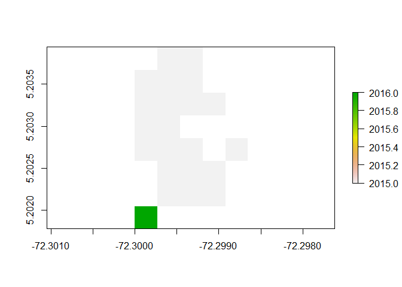<!-- -->

``` r
freq(dat35.yr)
```

    ##      value count
    ## [1,]  2015    21
    ## [2,]  2016     1
    ## [3,]    NA    18

``` r
unique(dat35.yr)
```

    ## [1] 2015 2016

This map shows that cells from two different years are being `clump`ed
into the same Fire (FireID == 35). So this approach is not appropriate.

[This SO post](https://stackoverflow.com/a/30097452) implies we need to
loop through Years (classes) creating clumps.

Or could we use the `landscapemetrics`
[package](https://r-spatialecology.github.io/landscapemetrics/index.html).
Let’s try this package
    first:

``` r
library(landscapemetrics)
```

    ## Warning: package 'landscapemetrics' was built under R version 3.6.2

``` r
p <- get_patches(sdat[["Year"]])

plot(stack(p))
```

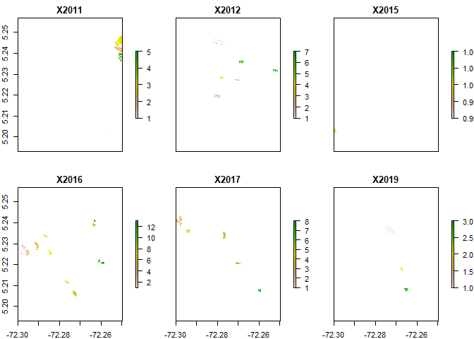<!-- -->

So `get_patches` returns a list of `raster` layers (which can then be
`stack`ed)

Let’s check the the patch classes identified by `get_patches` matches
what we see in the original data:

``` r
unique(sdat[["Year"]])
```

    ## [1] 2011 2012 2015 2016 2017 2019

So now, how can we extract the number of fires in each year? Ideally, we
will be able to extract a dataframe year by patch. First, we should
[check the
landscape](https://r-spatialecology.github.io/landscapemetrics/articles/getstarted.html#checking-your-landscape):

``` r
check_landscape(sdat[["Year"]])
```

    ## Warning: Caution: Coordinate reference system not metric - Units of results
    ## based on cellsizes and/or distances may be incorrect.

    ##   layer        crs   units   class n_classes OK
    ## 1     1 geographic degrees integer         6  x

`landscapemetrics` wants us to use CRS with units of m. Check the
current CRS:

``` r
crs(dat)
```

    ## CRS arguments:
    ##  +proj=longlat +datum=WGS84 +no_defs +ellps=WGS84 +towgs84=0,0,0

This is in decimal degrees. Using [this
webpage](https://www.latlong.net/lat-long-utm.html) it seems our study
area is UTM zone 19N. So re-project to UTM using proj.4 from
[EPSG:32619](https://epsg.io/32619):

``` r
sr <- "+proj=utm +zone=19 +datum=WGS84 +units=m +no_defs" 

sdat <- stack(sdat[["Year"]],sdat[["Magnitude"]],sdat[["Duration"]])
sdat.utm <- projectRaster(sdat, crs = sr, method="ngb")
plot(sdat.utm)
```

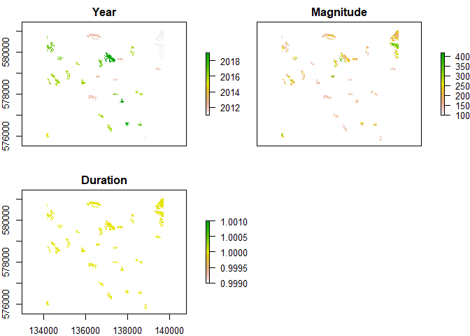<!-- -->

And then check landscape
    again:

``` r
check_landscape(sdat.utm)
```

    ## Warning: Caution: More than 30 land cover-classes - Please check if
    ## discrete land-cover classes are present.

    ##   layer       crs units   class n_classes  OK
    ## 1     1 projected     m integer         6   v
    ## 2     2 projected     m integer       251 (?)
    ## 3     3 projected     m integer         1   v

In this landscape check we see `Year` and `Duration` are fine, but
`Magnitude` should not be analysed using `landscapemetrics` (due to
number of classes, i.e. this is not a categorical variable, but
continuous).

Back to working out how to extract the number of fires in each
    year:

``` r
library(tidyverse)
```

    ## -- Attaching packages ----------------------------------------------------- tidyverse 1.2.1 --

    ## v ggplot2 3.2.1     v purrr   0.3.3
    ## v tibble  2.1.3     v dplyr   0.8.3
    ## v tidyr   1.0.0     v stringr 1.4.0
    ## v readr   1.3.1     v forcats 0.4.0

    ## -- Conflicts -------------------------------------------------------- tidyverse_conflicts() --
    ## x tidyr::extract() masks raster::extract()
    ## x dplyr::filter()  masks stats::filter()
    ## x dplyr::lag()     masks stats::lag()
    ## x dplyr::select()  masks raster::select()

``` r
#first calculate patch metric (area)
area <- lsm_p_area(sdat.utm[[1]])
area <- area %>% 
  rename(Year = class, Area_ha = value)
area 
```

    ## # A tibble: 37 x 6
    ##    layer level  Year    id metric Area_ha
    ##    <int> <chr> <int> <int> <chr>    <dbl>
    ##  1     1 patch  2011     1 area      1.43
    ##  2     1 patch  2011     2 area      6.42
    ##  3     1 patch  2011     3 area     11.8 
    ##  4     1 patch  2011     4 area      3.30
    ##  5     1 patch  2011     5 area      1.34
    ##  6     1 patch  2012     6 area      7.22
    ##  7     1 patch  2012     7 area      4.28
    ##  8     1 patch  2012     8 area      1.16
    ##  9     1 patch  2012     9 area      1.69
    ## 10     1 patch  2012    10 area      1.16
    ## # ... with 27 more rows

``` r
#now we can count fires in each year 
area %>% 
  group_by(Year) %>% 
  tally()
```

    ## # A tibble: 6 x 2
    ##    Year     n
    ##   <int> <int>
    ## 1  2011     5
    ## 2  2012     7
    ## 3  2015     1
    ## 4  2016    13
    ## 5  2017     8
    ## 6  2019     3

``` r
#and plot a bar chart
area %>% 
  group_by(Year) %>% 
  tally() %>%
  ggplot(aes(Year)) +
    geom_bar(aes(weight=n)) +
    xlab("Year")
```

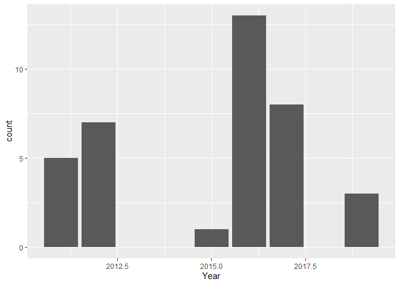<!-- -->

``` r
#we can also plot the distribution of area by year
ggplot(area, aes(Area_ha)) +
  geom_density() +
  facet_grid(Year ~.) +
  xlab("Area (ha)")
```

    ## Warning: Groups with fewer than two data points have been dropped.

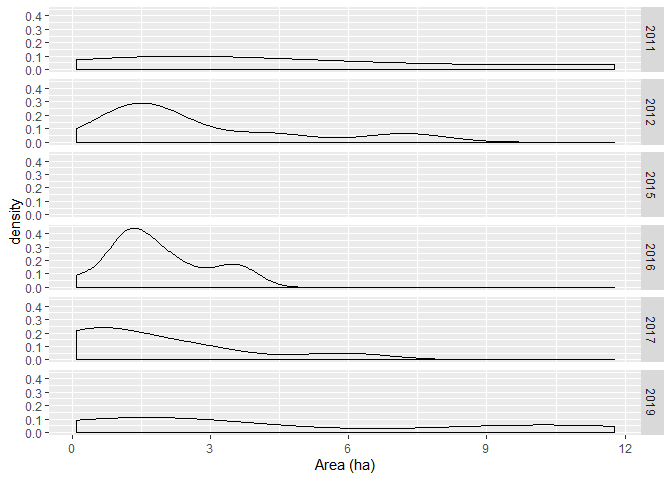<!-- -->

Definding patches by Year as class, we can think about things we might
want to compare between runs:

  - number of fires: overall use `lsp_l_np`, by year use `lsp_c_np`)
  - max and median fire size: no functions, so calculate overall (lsp)
    and by year (class) from `lsp_p_area`
  - total fire area: overall use `lsp_l_ta`, by year use `lsp_c_ca`

We can also think about [available shape
metrics](https://r-spatialecology.github.io/landscapemetrics/reference/index.html#section-patch-level-metrics)
(later).

However, this approach does not allow us to calculate metrics for the
continuous measures from LandTrendr. To do this we can use the `Year`
layer from the original data, plus a layer with unique patch IDs created
from from `get_patches()`:

``` r
mag <- sdat.utm[["Magnitude"]]

#get patches
p <- get_patches(sdat.utm[["Year"]])
plot(stack(p))
```

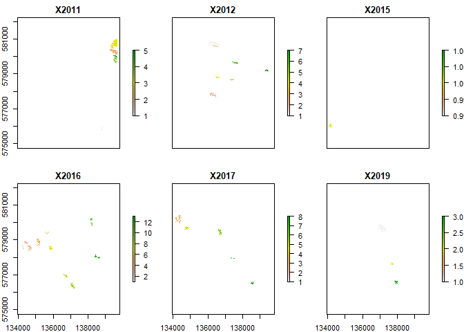<!-- -->

Remember `get_patches()` returns a raster for each year, restarting
patch numbering each year. So we need to loop to create unique patch ids
across ALL years:

``` r
patchID <- p[[1]] #initially patchID is the first layer of the stack

#loop to create unique patch ids across ALL years
for(i in 2:length(p)){

  #starting at i = 2, means val_base initially is calculated for pc
  val_base  = cellStats(patchID,stat='max',na.rm=TRUE)
  
  #update pc, adding the max value of the previous layer to all cell values
  patchID <- cover(patchID, calc(p[[i]], function(x) x + val_base))
}
```

Now create a stack of rasters containing original data, year-patches and
unique patchID

``` r
mag.s <- stack(mag, sdat.utm[["Year"]], patchID)
names(mag.s[[3]]) <- "Patch"

plot(mag.s)
```

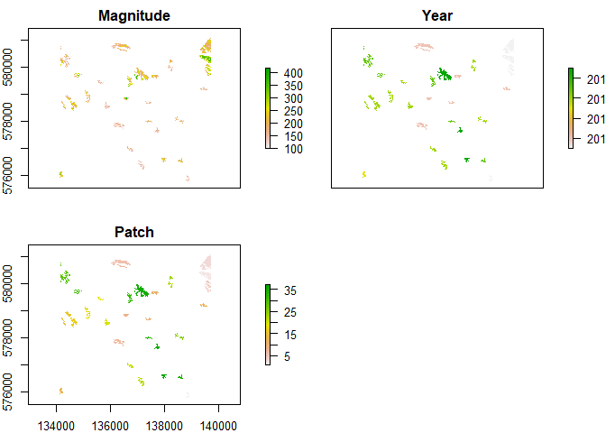<!-- -->

With this we can now calculate (zonal) statistics of magnitude by year:

``` r
#calculate summary of magnitudes by year
zs <- zonal(mag.s[["Magnitude"]], mag.s[["Year"]], fun=sum)
zm <- zonal(mag.s[["Magnitude"]], mag.s[["Year"]], fun=median)
zsd <- zonal(mag.s[["Magnitude"]], mag.s[["Year"]], fun=sd)

mag.yr <- left_join(as.data.frame(zs), as.data.frame(zm), by = "zone")
mag.yr <- left_join(mag.yr, as.data.frame(zsd), by = "zone")
names(mag.yr) <- c("Patch", "Sum", "Median", "SD")

mag.yr
```

    ##   Patch   Sum Median       SD
    ## 1  2011 64404  229.0 62.65028
    ## 2  2012 37871  162.0 53.83527
    ## 3  2015  5479  246.0 53.08757
    ## 4  2016 46245  161.0 45.34462
    ## 5  2017 32091  198.5 55.71017
    ## 6  2019 31421  204.0 63.74124

And by patch:

``` r
#calculate summary of magnitudes by patch
zs <- zonal(mag.s[["Magnitude"]], mag.s[["Patch"]], fun=sum)
zm <- zonal(mag.s[["Magnitude"]], mag.s[["Patch"]], fun=median)
zsd <- zonal(mag.s[["Magnitude"]], mag.s[["Patch"]], fun=sd)

mag.patch <- left_join(as.data.frame(zs), as.data.frame(zm), by = "zone")
mag.patch <- left_join(mag.patch, as.data.frame(zsd), by = "zone")
names(mag.patch) <- c("Patch", "Sum", "Median", "SD")

mag.patch
```

    ##    Patch   Sum Median        SD
    ## 1      1  2142  128.0 23.223192
    ## 2      2 22422  311.5 40.173479
    ## 3      3 27301  205.5 34.262680
    ## 4      4  9211  266.0 45.169401
    ## 5      5  3328  220.0 33.818564
    ## 6      6 14617  170.0 42.799839
    ## 7      7  6731  138.5 18.758532
    ## 8      8  2536  191.0 24.181472
    ## 9      9  5019  275.0 86.629007
    ## 10    10  1777  140.0 25.965954
    ## 11    11  4924  203.0 36.415976
    ## 12    12  2267  142.0 25.554435
    ## 13    13  5479  246.0 53.087574
    ## 14    14   216  216.0        NA
    ## 15    15  2795  199.5 37.626928
    ## 16    16  4460  184.0 47.973083
    ## 17    17  8903  220.0 43.368361
    ## 18    18  7893  186.0 40.859302
    ## 19    19  2377  153.0 17.854855
    ## 20    20  3540  140.0 22.149116
    ## 21    21  2834  144.0 24.545339
    ## 22    22  4592  128.5 21.779809
    ## 23    23  2693  147.5 24.904852
    ## 24    24  2065  193.0 38.853805
    ## 25    25  1786  145.0 30.316012
    ## 26    26  2091  143.0 45.058936
    ## 27    27   158  158.0        NA
    ## 28    28   300  150.0 19.798990
    ## 29    29 11643  169.5 36.057210
    ## 30    30   517  258.5  6.363961
    ## 31    31  6664  270.0 61.168538
    ## 32    32  8208  249.0 44.195240
    ## 33    33  1856  166.0 30.146611
    ## 34    34  2745  208.0 21.632715
    ## 35    35 24699  207.0 65.978739
    ## 36    36  2405  138.0 33.589123
    ## 37    37  4317  221.5 43.830145

It might also be useful to consider the Year in which each patch burned,
so attach year to individual
patches:

``` r
#create table to cover all patchIDs (with years) to join to the mag.patch table... 
yr_ls <- unique(mag.s[["Year"]])
ids <- unique(mag.s[["Patch"]])

yr_counts <- c()
for(i in seq_along(p)){
   yr_counts <- c(yr_counts, cellStats(p[[i]],stat='max',na.rm=TRUE))
}

yrs <-cbind(yr_ls, yr_counts)
yrs <- yrs[rep(seq_len(nrow(yrs)),yrs[,2]),1:2] #expand the table
yrs <- as.data.frame(cbind(yrs, ids))

##now join to the original table 
mag.patch <- left_join(mag.patch, yrs, by = c("Patch" = "ids"))
mag.patch <- mag.patch %>%
  select(-yr_counts) %>%
  rename(Year = yr_ls)

mag.patch
```

    ##    Patch   Sum Median        SD Year
    ## 1      1  2142  128.0 23.223192 2011
    ## 2      2 22422  311.5 40.173479 2011
    ## 3      3 27301  205.5 34.262680 2011
    ## 4      4  9211  266.0 45.169401 2011
    ## 5      5  3328  220.0 33.818564 2011
    ## 6      6 14617  170.0 42.799839 2012
    ## 7      7  6731  138.5 18.758532 2012
    ## 8      8  2536  191.0 24.181472 2012
    ## 9      9  5019  275.0 86.629007 2012
    ## 10    10  1777  140.0 25.965954 2012
    ## 11    11  4924  203.0 36.415976 2012
    ## 12    12  2267  142.0 25.554435 2012
    ## 13    13  5479  246.0 53.087574 2015
    ## 14    14   216  216.0        NA 2016
    ## 15    15  2795  199.5 37.626928 2016
    ## 16    16  4460  184.0 47.973083 2016
    ## 17    17  8903  220.0 43.368361 2016
    ## 18    18  7893  186.0 40.859302 2016
    ## 19    19  2377  153.0 17.854855 2016
    ## 20    20  3540  140.0 22.149116 2016
    ## 21    21  2834  144.0 24.545339 2016
    ## 22    22  4592  128.5 21.779809 2016
    ## 23    23  2693  147.5 24.904852 2016
    ## 24    24  2065  193.0 38.853805 2016
    ## 25    25  1786  145.0 30.316012 2016
    ## 26    26  2091  143.0 45.058936 2016
    ## 27    27   158  158.0        NA 2017
    ## 28    28   300  150.0 19.798990 2017
    ## 29    29 11643  169.5 36.057210 2017
    ## 30    30   517  258.5  6.363961 2017
    ## 31    31  6664  270.0 61.168538 2017
    ## 32    32  8208  249.0 44.195240 2017
    ## 33    33  1856  166.0 30.146611 2017
    ## 34    34  2745  208.0 21.632715 2017
    ## 35    35 24699  207.0 65.978739 2019
    ## 36    36  2405  138.0 33.589123 2019
    ## 37    37  4317  221.5 43.830145 2019

So now for these continuous variables we could examine the following
between runs (using magnitude as an example):

  - total (all years) and annual magnitude between runs
  - max/median magnitude (total and per year) between runs
  - distribution (e.g. SD) of patch magnitude for a given year (or all
    years)
