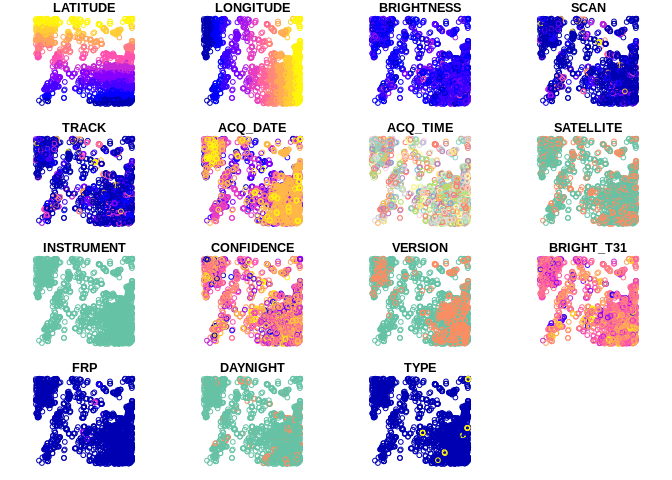
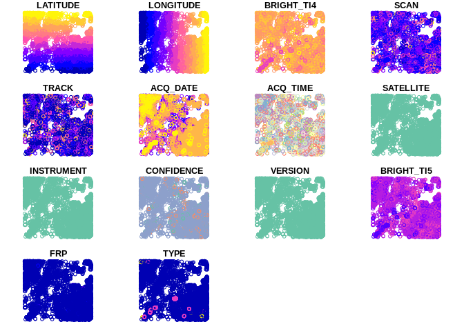
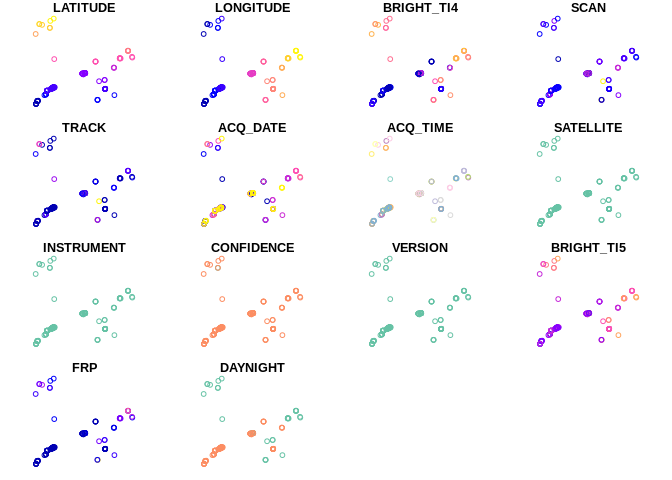
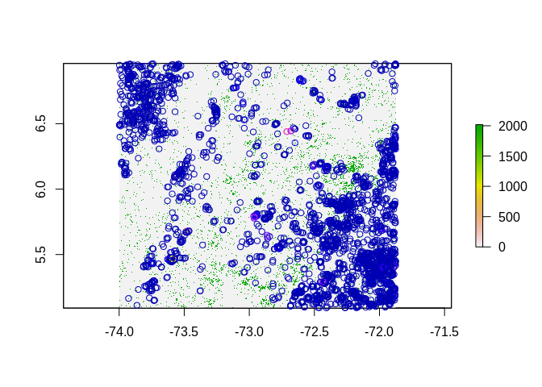
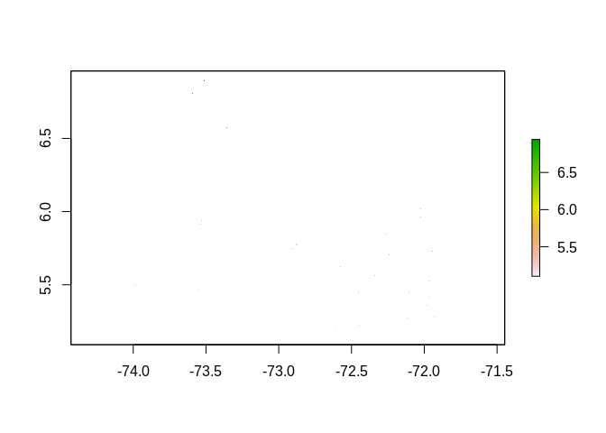
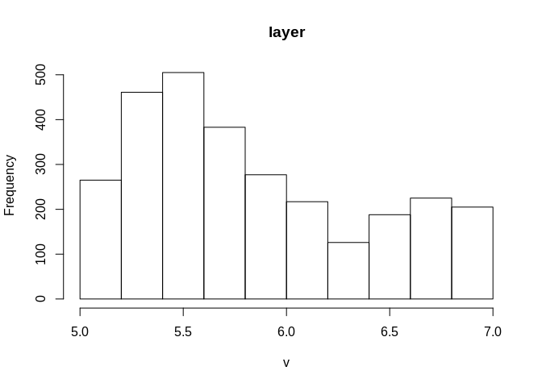
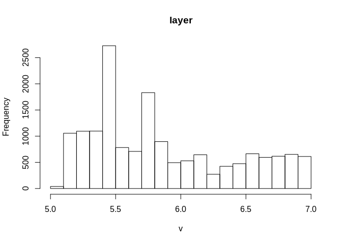
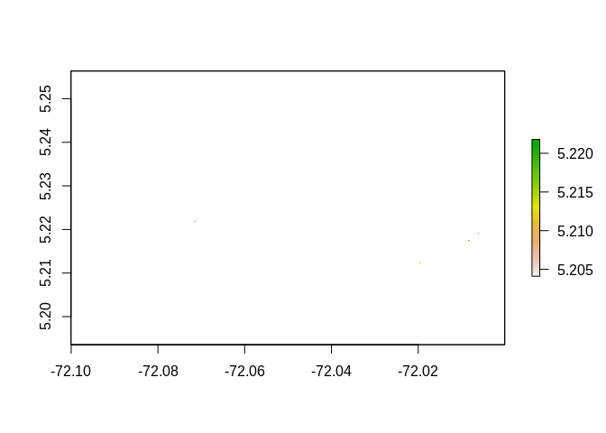
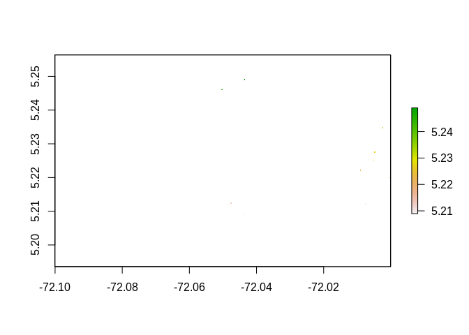
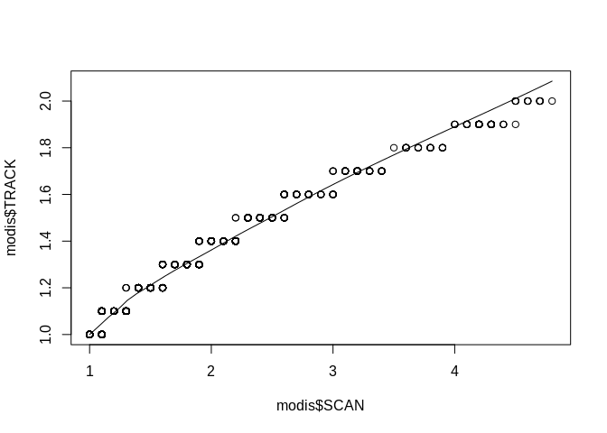

ExploreMV
================
James Millington
16/02/2020

## Introduction

Email from Kris, 2020-02-10

> The FIRMS fire data (MODIS C6 & VIIRS) for 20 Jan 2012 (date VIIRS
> data became available from) to 30 Nov 2019 can be found at:
> `Data/URLs/REF2`

> There are separate zip folders for MODIS and VIIRS. Note also, though
> the data is shp, there were options for outputs as csvs or jsons. I
> used the same extent as I’ve been running for LandTrendr (covering all
> the Páramos of Boyacá).

The aim here is to load these data and raterise them for comparison with
the LandTrendR data (e.g.
[ExploreLTR](https://github.com/jamesdamillington/LandTrendr-Paramo/blob/master/ExploreLTR.md)

## Check Data

Try loading MODIS
    shapefile

``` r
library(sf)
```

    ## Linking to GEOS 3.6.2, GDAL 2.2.3, PROJ 4.9.3

``` r
library(tidyverse)
```

    ## ── Attaching packages ─────────────────────────────────────────────────────────────────────────────────── tidyverse 1.3.0 ──

    ## ✓ ggplot2 3.2.1     ✓ purrr   0.3.3
    ## ✓ tibble  2.1.3     ✓ dplyr   0.8.4
    ## ✓ tidyr   1.0.2     ✓ stringr 1.4.0
    ## ✓ readr   1.3.1     ✓ forcats 0.4.0

    ## ── Conflicts ────────────────────────────────────────────────────────────────────────────────────── tidyverse_conflicts() ──
    ## x dplyr::filter() masks stats::filter()
    ## x dplyr::lag()    masks stats::lag()

``` r
modis <- st_read("Data/MODIS/fire_archive_M6_103936.shp")
```

    ## Reading layer `fire_archive_M6_103936' from data source `/home/james/OneDrive/Research/Projects/ColombiaBIO/Fire/LandTrendr-Paramo/Data/MODIS/fire_archive_M6_103936.shp' using driver `ESRI Shapefile'
    ## Simple feature collection with 2857 features and 15 fields
    ## geometry type:  POINT
    ## dimension:      XY
    ## bbox:           xmin: -73.9986 ymin: 5.0918 xmax: -71.8752 ymax: 6.9583
    ## epsg (SRID):    4326
    ## proj4string:    +proj=longlat +datum=WGS84 +no_defs

``` r
glimpse(modis)
```

    ## Observations: 2,857
    ## Variables: 16
    ## $ LATITUDE   <dbl> 5.7746, 5.4349, 5.4130, 5.3444, 5.6687, 5.3457, 5.7985, 5.…
    ## $ LONGITUDE  <dbl> -72.8813, -72.1017, -72.1050, -71.8961, -72.4753, -71.9052…
    ## $ BRIGHTNESS <dbl> 308.9, 320.2, 326.4, 323.4, 314.6, 325.5, 311.8, 321.6, 31…
    ## $ SCAN       <dbl> 1.0, 1.1, 1.1, 1.0, 1.1, 1.0, 1.0, 1.0, 1.2, 1.7, 1.7, 1.7…
    ## $ TRACK      <dbl> 1.0, 1.1, 1.1, 1.0, 1.0, 1.0, 1.0, 1.0, 1.1, 1.3, 1.3, 1.3…
    ## $ ACQ_DATE   <date> 2012-01-20, 2012-01-20, 2012-01-20, 2012-01-22, 2012-01-2…
    ## $ ACQ_TIME   <fct> 1529, 1529, 1828, 1517, 1517, 1517, 1816, 1816, 1810, 1841…
    ## $ SATELLITE  <fct> Terra, Terra, Aqua, Terra, Terra, Terra, Aqua, Aqua, Aqua,…
    ## $ INSTRUMENT <fct> MODIS, MODIS, MODIS, MODIS, MODIS, MODIS, MODIS, MODIS, MO…
    ## $ CONFIDENCE <int> 40, 73, 61, 75, 57, 78, 0, 75, 68, 79, 52, 67, 50, 78, 70,…
    ## $ VERSION    <fct> 6.2, 6.2, 6.2, 6.2, 6.2, 6.2, 6.2, 6.2, 6.2, 6.2, 6.2, 6.2…
    ## $ BRIGHT_T31 <dbl> 293.2, 297.4, 299.8, 298.9, 297.4, 299.7, 289.6, 300.2, 29…
    ## $ FRP        <dbl> 6.8, 12.6, 17.4, 13.5, 7.3, 15.6, 9.4, 14.4, 12.7, 40.6, 2…
    ## $ DAYNIGHT   <fct> D, D, D, D, D, D, D, D, D, D, D, D, N, D, D, D, N, D, D, D…
    ## $ TYPE       <dbl> 0, 0, 0, 0, 0, 0, 0, 0, 0, 0, 0, 0, 0, 0, 0, 0, 0, 0, 0, 0…
    ## $ geometry   <POINT [°]> POINT (-72.8813 5.7746), POINT (-72.1017 5.4349), PO…

``` r
plot(modis, max.plot = 16)
```

<!-- -->

And plot with interactive map:

``` r
library(mapview)

m <- mapview(modis, zcol=c("FRP","SATELLITE","BRIGHT_T31"), lwd = 0, alpha.regions = 1, cex = 5, map.types=c("Esri.WorldImagery","OpenTopoMap"))

#m    #plot mapview object only works in HTML

mapshot(m, file = paste0(getwd(), "/Data/msmap.png")) #create mapshot for non-html
```


Note: `mapview` doesn’t seem to like plotting `date` variables?

``` r
mapview(modis["ACQ_DATE"])
```

    ## NULL

Try loading VIIRS
    shapefiles

``` r
viirs_a <- st_read("Data/VIIRS/fire_archive_V1_103937.shp")
```

    ## Reading layer `fire_archive_V1_103937' from data source `/home/james/OneDrive/Research/Projects/ColombiaBIO/Fire/LandTrendr-Paramo/Data/VIIRS/fire_archive_V1_103937.shp' using driver `ESRI Shapefile'
    ## Simple feature collection with 18295 features and 14 fields
    ## geometry type:  POINT
    ## dimension:      XY
    ## bbox:           xmin: -73.99962 ymin: 5.09148 xmax: -71.8754 ymax: 6.95895
    ## epsg (SRID):    4326
    ## proj4string:    +proj=longlat +datum=WGS84 +no_defs

``` r
glimpse(viirs_a)
```

    ## Observations: 18,295
    ## Variables: 15
    ## $ LATITUDE   <dbl> 5.18970, 5.58602, 5.43740, 5.44455, 5.34590, 6.14975, 6.14…
    ## $ LONGITUDE  <dbl> -73.87965, -71.96741, -72.11044, -72.45283, -71.91270, -73…
    ## $ BRIGHT_TI4 <dbl> 297.3, 342.7, 333.2, 304.1, 343.9, 337.9, 326.2, 332.6, 34…
    ## $ SCAN       <dbl> 0.40, 0.38, 0.39, 0.42, 0.51, 0.41, 0.41, 0.41, 0.41, 0.41…
    ## $ TRACK      <dbl> 0.37, 0.59, 0.59, 0.37, 0.66, 0.61, 0.61, 0.60, 0.60, 0.60…
    ## $ ACQ_DATE   <date> 2012-01-20, 2012-01-20, 2012-01-20, 2012-01-21, 2012-01-2…
    ## $ ACQ_TIME   <fct> 0628, 1732, 1732, 0609, 1853, 1853, 1853, 1854, 1854, 1854…
    ## $ SATELLITE  <fct> N, N, N, N, N, N, N, N, N, N, N, N, N, N, N, N, N, N, N, N…
    ## $ INSTRUMENT <fct> VIIRS, VIIRS, VIIRS, VIIRS, VIIRS, VIIRS, VIIRS, VIIRS, VI…
    ## $ CONFIDENCE <fct> n, n, n, n, n, n, n, n, n, n, n, n, n, n, n, n, n, n, n, n…
    ## $ VERSION    <fct> 1, 1, 1, 1, 1, 1, 1, 1, 1, 1, 1, 1, 1, 1, 1, 1, 1, 1, 1, 1…
    ## $ BRIGHT_TI5 <dbl> 279.2, 291.2, 291.7, 289.1, 298.2, 294.3, 294.0, 293.2, 29…
    ## $ FRP        <dbl> 1.3, 5.2, 3.8, 0.6, 6.2, 3.8, 3.1, 3.2, 4.2, 4.7, 4.8, 8.4…
    ## $ TYPE       <dbl> 2, 0, 0, 2, 0, 0, 0, 0, 0, 0, 0, 0, 0, 0, 0, 2, 0, 0, 0, 0…
    ## $ geometry   <POINT [°]> POINT (-73.87965 5.1897), POINT (-71.96741 5.58602),…

``` r
plot(viirs_a, max.plot = 15)
```

<!-- -->

``` r
viirs_nrt <- st_read("Data/VIIRS/fire_nrt_V1_103937.shp")
```

    ## Reading layer `fire_nrt_V1_103937' from data source `/home/james/OneDrive/Research/Projects/ColombiaBIO/Fire/LandTrendr-Paramo/Data/VIIRS/fire_nrt_V1_103937.shp' using driver `ESRI Shapefile'
    ## Simple feature collection with 181 features and 14 fields
    ## geometry type:  POINT
    ## dimension:      XY
    ## bbox:           xmin: -73.91602 ymin: 5.12905 xmax: -71.8812 ymax: 6.91487
    ## epsg (SRID):    4326
    ## proj4string:    +proj=longlat +datum=WGS84 +no_defs

``` r
glimpse(viirs_a)
```

    ## Observations: 18,295
    ## Variables: 15
    ## $ LATITUDE   <dbl> 5.18970, 5.58602, 5.43740, 5.44455, 5.34590, 6.14975, 6.14…
    ## $ LONGITUDE  <dbl> -73.87965, -71.96741, -72.11044, -72.45283, -71.91270, -73…
    ## $ BRIGHT_TI4 <dbl> 297.3, 342.7, 333.2, 304.1, 343.9, 337.9, 326.2, 332.6, 34…
    ## $ SCAN       <dbl> 0.40, 0.38, 0.39, 0.42, 0.51, 0.41, 0.41, 0.41, 0.41, 0.41…
    ## $ TRACK      <dbl> 0.37, 0.59, 0.59, 0.37, 0.66, 0.61, 0.61, 0.60, 0.60, 0.60…
    ## $ ACQ_DATE   <date> 2012-01-20, 2012-01-20, 2012-01-20, 2012-01-21, 2012-01-2…
    ## $ ACQ_TIME   <fct> 0628, 1732, 1732, 0609, 1853, 1853, 1853, 1854, 1854, 1854…
    ## $ SATELLITE  <fct> N, N, N, N, N, N, N, N, N, N, N, N, N, N, N, N, N, N, N, N…
    ## $ INSTRUMENT <fct> VIIRS, VIIRS, VIIRS, VIIRS, VIIRS, VIIRS, VIIRS, VIIRS, VI…
    ## $ CONFIDENCE <fct> n, n, n, n, n, n, n, n, n, n, n, n, n, n, n, n, n, n, n, n…
    ## $ VERSION    <fct> 1, 1, 1, 1, 1, 1, 1, 1, 1, 1, 1, 1, 1, 1, 1, 1, 1, 1, 1, 1…
    ## $ BRIGHT_TI5 <dbl> 279.2, 291.2, 291.7, 289.1, 298.2, 294.3, 294.0, 293.2, 29…
    ## $ FRP        <dbl> 1.3, 5.2, 3.8, 0.6, 6.2, 3.8, 3.1, 3.2, 4.2, 4.7, 4.8, 8.4…
    ## $ TYPE       <dbl> 2, 0, 0, 2, 0, 0, 0, 0, 0, 0, 0, 0, 0, 0, 0, 2, 0, 0, 0, 0…
    ## $ geometry   <POINT [°]> POINT (-73.87965 5.1897), POINT (-71.96741 5.58602),…

``` r
plot(viirs_nrt, max.plot = 15)
```

<!-- -->

Given we only have the archive for MODIS and the near-real time (NRT)
for VIIRS eventually makes its way into the archive, I guess we can just
use the archive data for now.

Get max and min dates from `ACQ_DATE`

``` r
print("modis")
```

    ## [1] "modis"

``` r
print(paste0("earliest: ", min(modis$ACQ_DATE)))
```

    ## [1] "earliest: 2012-01-20"

``` r
print(paste0("latest: ", max(modis$ACQ_DATE)))
```

    ## [1] "latest: 2019-11-25"

``` r
print("viirs")
```

    ## [1] "viirs"

``` r
print(paste0("earliest: ", min(viirs_a$ACQ_DATE)))
```

    ## [1] "earliest: 2012-01-20"

``` r
print(paste0("latest: ", max(viirs_a$ACQ_DATE)))
```

    ## [1] "latest: 2019-09-29"

VIIRS data in the archive don’t stretch as late as MODIS. So do I need
to merge `viirs_nrt` with `viirs_a`? Check dates for `viirs_nrt`

``` r
print("viirs nrt")
```

    ## [1] "viirs nrt"

``` r
print(paste0("earliest: ", min(viirs_nrt$ACQ_DATE)))
```

    ## [1] "earliest: 2019-10-01"

``` r
print(paste0("latest: ", max(viirs_nrt$ACQ_DATE)))
```

    ## [1] "latest: 2019-11-29"

VIIRS runs to 2010-11-29 vs 2019-11-25 for MODIS. So merge and remove
dates after 2019-11-25 from VIIRS

``` r
glimpse(viirs_a)
```

    ## Observations: 18,295
    ## Variables: 15
    ## $ LATITUDE   <dbl> 5.18970, 5.58602, 5.43740, 5.44455, 5.34590, 6.14975, 6.14…
    ## $ LONGITUDE  <dbl> -73.87965, -71.96741, -72.11044, -72.45283, -71.91270, -73…
    ## $ BRIGHT_TI4 <dbl> 297.3, 342.7, 333.2, 304.1, 343.9, 337.9, 326.2, 332.6, 34…
    ## $ SCAN       <dbl> 0.40, 0.38, 0.39, 0.42, 0.51, 0.41, 0.41, 0.41, 0.41, 0.41…
    ## $ TRACK      <dbl> 0.37, 0.59, 0.59, 0.37, 0.66, 0.61, 0.61, 0.60, 0.60, 0.60…
    ## $ ACQ_DATE   <date> 2012-01-20, 2012-01-20, 2012-01-20, 2012-01-21, 2012-01-2…
    ## $ ACQ_TIME   <fct> 0628, 1732, 1732, 0609, 1853, 1853, 1853, 1854, 1854, 1854…
    ## $ SATELLITE  <fct> N, N, N, N, N, N, N, N, N, N, N, N, N, N, N, N, N, N, N, N…
    ## $ INSTRUMENT <fct> VIIRS, VIIRS, VIIRS, VIIRS, VIIRS, VIIRS, VIIRS, VIIRS, VI…
    ## $ CONFIDENCE <fct> n, n, n, n, n, n, n, n, n, n, n, n, n, n, n, n, n, n, n, n…
    ## $ VERSION    <fct> 1, 1, 1, 1, 1, 1, 1, 1, 1, 1, 1, 1, 1, 1, 1, 1, 1, 1, 1, 1…
    ## $ BRIGHT_TI5 <dbl> 279.2, 291.2, 291.7, 289.1, 298.2, 294.3, 294.0, 293.2, 29…
    ## $ FRP        <dbl> 1.3, 5.2, 3.8, 0.6, 6.2, 3.8, 3.1, 3.2, 4.2, 4.7, 4.8, 8.4…
    ## $ TYPE       <dbl> 2, 0, 0, 2, 0, 0, 0, 0, 0, 0, 0, 0, 0, 0, 0, 2, 0, 0, 0, 0…
    ## $ geometry   <POINT [°]> POINT (-73.87965 5.1897), POINT (-71.96741 5.58602),…

``` r
glimpse(viirs_nrt)
```

    ## Observations: 181
    ## Variables: 15
    ## $ LATITUDE   <dbl> 5.46358, 5.77325, 5.77657, 5.40500, 5.40830, 5.12991, 5.18…
    ## $ LONGITUDE  <dbl> -73.55594, -72.87874, -72.87823, -73.67797, -73.67745, -73…
    ## $ BRIGHT_TI4 <dbl> 300.7, 295.8, 302.8, 295.7, 307.5, 305.4, 301.9, 306.2, 30…
    ## $ SCAN       <dbl> 0.38, 0.39, 0.39, 0.38, 0.38, 0.38, 0.38, 0.38, 0.38, 0.38…
    ## $ TRACK      <dbl> 0.36, 0.36, 0.36, 0.36, 0.36, 0.36, 0.36, 0.36, 0.36, 0.36…
    ## $ ACQ_DATE   <date> 2019-10-01, 2019-10-01, 2019-10-01, 2019-10-01, 2019-10-0…
    ## $ ACQ_TIME   <fct> 0618, 0618, 0618, 0618, 0618, 0618, 0618, 0618, 0618, 0618…
    ## $ SATELLITE  <fct> N, N, N, N, N, N, N, N, N, N, N, N, N, N, N, N, N, N, N, N…
    ## $ INSTRUMENT <fct> VIIRS, VIIRS, VIIRS, VIIRS, VIIRS, VIIRS, VIIRS, VIIRS, VI…
    ## $ CONFIDENCE <fct> n, n, n, n, n, n, n, n, n, n, n, n, n, n, n, n, n, n, n, n…
    ## $ VERSION    <fct> 1.0NRT, 1.0NRT, 1.0NRT, 1.0NRT, 1.0NRT, 1.0NRT, 1.0NRT, 1.…
    ## $ BRIGHT_TI5 <dbl> 275.5, 280.4, 279.4, 271.3, 271.7, 274.8, 269.9, 269.8, 26…
    ## $ FRP        <dbl> 0.8, 0.7, 0.6, 0.9, 0.7, 1.0, 1.2, 1.1, 0.7, 0.9, 1.1, 0.6…
    ## $ DAYNIGHT   <fct> N, N, N, N, N, N, N, N, N, N, N, N, N, N, N, N, N, N, N, N…
    ## $ geometry   <POINT [°]> POINT (-73.55594 5.46358), POINT (-72.87874 5.77325)…

15 variables in each so we should be able to just bind the rows

``` r
viirs <- rbind(viirs_a, viirs_nrt)
```

But the above thows and error: `Error in match.names(clabs, names(xi)) :
names do not match previous names`

The problem is `DAYNIGHT` in archive but not nrt and `TYPE` *vice
versa*. We need common variables to be able to bind rows

``` r
viirs_a <- select(viirs_a, -TYPE)

viirs_nrt <- select(viirs_nrt, -DAYNIGHT)

all_equal(colnames(viirs_a), colnames(viirs_nrt))
```

    ## [1] TRUE

Now try to bind rows

``` r
viirs <- rbind(viirs_a, viirs_nrt)

glimpse(viirs)
```

    ## Observations: 18,476
    ## Variables: 14
    ## $ LATITUDE   <dbl> 5.18970, 5.58602, 5.43740, 5.44455, 5.34590, 6.14975, 6.14…
    ## $ LONGITUDE  <dbl> -73.87965, -71.96741, -72.11044, -72.45283, -71.91270, -73…
    ## $ BRIGHT_TI4 <dbl> 297.3, 342.7, 333.2, 304.1, 343.9, 337.9, 326.2, 332.6, 34…
    ## $ SCAN       <dbl> 0.40, 0.38, 0.39, 0.42, 0.51, 0.41, 0.41, 0.41, 0.41, 0.41…
    ## $ TRACK      <dbl> 0.37, 0.59, 0.59, 0.37, 0.66, 0.61, 0.61, 0.60, 0.60, 0.60…
    ## $ ACQ_DATE   <date> 2012-01-20, 2012-01-20, 2012-01-20, 2012-01-21, 2012-01-2…
    ## $ ACQ_TIME   <fct> 0628, 1732, 1732, 0609, 1853, 1853, 1853, 1854, 1854, 1854…
    ## $ SATELLITE  <fct> N, N, N, N, N, N, N, N, N, N, N, N, N, N, N, N, N, N, N, N…
    ## $ INSTRUMENT <fct> VIIRS, VIIRS, VIIRS, VIIRS, VIIRS, VIIRS, VIIRS, VIIRS, VI…
    ## $ CONFIDENCE <fct> n, n, n, n, n, n, n, n, n, n, n, n, n, n, n, n, n, n, n, n…
    ## $ VERSION    <fct> 1, 1, 1, 1, 1, 1, 1, 1, 1, 1, 1, 1, 1, 1, 1, 1, 1, 1, 1, 1…
    ## $ BRIGHT_TI5 <dbl> 279.2, 291.2, 291.7, 289.1, 298.2, 294.3, 294.0, 293.2, 29…
    ## $ FRP        <dbl> 1.3, 5.2, 3.8, 0.6, 6.2, 3.8, 3.1, 3.2, 4.2, 4.7, 4.8, 8.4…
    ## $ geometry   <POINT [°]> POINT (-73.87965 5.1897), POINT (-71.96741 5.58602),…

Number of records seems to match (`18295 + 181 = 18796`)

## Rasterise

Load the `.tif`

``` r
library(raster)
```

    ## Loading required package: sp

    ## 
    ## Attaching package: 'raster'

    ## The following object is masked from 'package:dplyr':
    ## 
    ##     select

    ## The following object is masked from 'package:tidyr':
    ## 
    ##     extract

``` r
ltr <- stack("Data/LTGEE20012020.tif")
names(ltr)
```

    ## [1] "yod"    "mag"    "dur"    "preval" "rate"   "dsnr"

``` r
names(ltr) <- c("Year", "Magnitude", "Duration", "Pre Value", "Spec Chg", "DSNR")
```

Plot with modis for a quick view

``` r
plot(ltr[["Year"]])
plot(modis["FRP"], add=T)
```

<!-- -->

Compare the extents and crs’s of our three datasets

``` r
print("ltr")
```

    ## [1] "ltr"

``` r
extent(ltr)
```

    ## class      : Extent 
    ## xmin       : -74.00025 
    ## xmax       : -71.87474 
    ## ymin       : 5.090753 
    ## ymax       : 6.960237

``` r
crs(ltr)
```

    ## CRS arguments:
    ##  +proj=longlat +datum=WGS84 +no_defs +ellps=WGS84 +towgs84=0,0,0

``` r
print("modis")
```

    ## [1] "modis"

``` r
extent(modis)
```

    ## class      : Extent 
    ## xmin       : -73.9986 
    ## xmax       : -71.8752 
    ## ymin       : 5.0918 
    ## ymax       : 6.9583

``` r
crs(modis)
```

    ## [1] "+proj=longlat +datum=WGS84 +no_defs"

``` r
print("viirs")
```

    ## [1] "viirs"

``` r
extent(viirs)
```

    ## class      : Extent 
    ## xmin       : -73.99962 
    ## xmax       : -71.8754 
    ## ymin       : 5.09148 
    ## ymax       : 6.95895

``` r
crs(viirs)
```

    ## [1] "+proj=longlat +datum=WGS84 +no_defs"

Extents looks pretty consistent and everything is unprojected so we can
try rasterize-ing as-is

``` r
modis_ras <- rasterize(modis, ltr, field="LATITUDE",fun='last')
plot(modis_ras)
```

<!-- -->

``` r
viirs_ras <- rasterize(viirs, ltr, field="LATITUDE",fun='last')
plot(viirs_ras)
```

<!-- -->

These may look like empty rasters but we can check summaries of the
`raster`s to see what data they contain

``` r
summary(modis_ras)
```

    ##                layer
    ## Min.    5.091800e+00
    ## 1st Qu. 5.392250e+00
    ## Median  5.721250e+00
    ## 3rd Qu. 6.255850e+00
    ## Max.    6.958300e+00
    ## NA's    5.470927e+07

``` r
summary(viirs_ras)
```

    ##                layer
    ## Min.    5.091480e+00
    ## 1st Qu. 5.442353e+00
    ## Median  5.753030e+00
    ## 3rd Qu. 6.295360e+00
    ## Max.    6.958950e+00
    ## NA's    5.469590e+07

So it looks like many cells without data. Let’s do some histograms
quickly too as another check:

``` r
hist(modis_ras)
```

<!-- -->

``` r
hist(viirs_ras)
```

<!-- -->

Let’s crop the raster to enlarge plotted pixels to see if we can see any
data

``` r
crp <- c(-72.1, -72, 5.2, 5.25)
m <- crop(modis_ras, crp)
v<- crop(viirs_ras, crp)
plot(m)
```

<!-- -->

``` r
plot(v)
```

<!-- -->

Looks like we can see a couple of data pixels.

## Questions

But the above isn’t really what we want as the MODIS and VIIRS data are
points at the centre of much larger pixels than the 30m of LandTrendR.
For
[MODIS](https://earthdata.nasa.gov/earth-observation-data/near-real-time/firms/c6-mcd14dl#ed-firms-attributes):

> The thermal anomalies / active fire represent the center of a 1km
> pixel that is flagged by the MODIS MOD14/MYD14 Fire and Thermal
> Anomalies algorithm (Giglio 2003) as containing one or more fires
> within the pixel.

For
[VIIRS](https://earthdata.nasa.gov/earth-observation-data/near-real-time/firms/v1-vnp14imgt)
locations are:

> Center of nominal 375 m fire pixel

So, how to create rasters that align for the three different products?
Might there be a solution in the `SCAN` (the *along scan pixel size*)
and `TRACK` (the *along track pixel size*) fields? For
[MODIS](https://earthdata.nasa.gov/earth-observation-data/near-real-time/firms/c6-mcd14dl#ed-firms-attributes):

> The algorithm produces 1km fire pixels but MODIS pixels get bigger
> toward the edge of scan. Scan and track reflect actual pixel size.

Similarly For
[VIIRS](https://earthdata.nasa.gov/earth-observation-data/near-real-time/firms/v1-vnp14imgt):

> The algorithm produces approximately 375 m pixels at nadir. Scan and
> track reflect actual pixel size.

Using this information I could go back to the point shapefiles and
create polygons for each point, buffering around the point using the
values of `SCAN` and `TRACK` for each point. A challenge here is that I
don’t know the direction of the track (or scan) so don’t know the
orientation in which the polygon should be created. \[Maps\] of orbit
trajectories (e.g. Fig3 in the [VIIRS user
guide]()<https://viirsland.gsfc.nasa.gov/PDF/VIIRS_activefire_User_Guide>)
suggest the swaths though be pretty consistent in direction over our
study area… just need to work out the angles.

But… For MODIS is appears `SCAN` and `TRACK` have [directions
specified](https://earthdata.nasa.gov/faq/firms-faq#ed-wfm-downloa):

> The scan value represents the spatial-resolution in the East-West
> direction of the scan and the track value represents the North-South
> spatial resolution of the scan.

Can I also assume this for VIIRS? The [FIRMS interactive
map](https://firms.modaps.eosdis.nasa.gov/map) seems to imply this might
be okay…


I assume this approach (of ‘buffering points’) is needed if I want to
create rasters from the point files. *But do raster grids for these
products already exist?* The screenshot above and the reference to
VIIRS’ “nominal 375m fire pixel” implies to me that there is no
‘standard’ grid to which all pixels could be tied. So do I need to
pursue the ‘buffering points’ approach?

Finally, once I have derived the MODIS and VIIRS layers I will have
three raster layers all at 30m resolution. We can then measure the
overlap between them, e.g. how many LTR fire pixels are also indicated
as fires by MODIS and VIIRS? Estimating area seems more challenging
using this 3-layer method as I think we would expect LTR to producing
smaller fire area given the finer resolution of data.

### Other

Quick check on relationship between `SCAN` and
    `TRACK`

``` r
scatter.smooth(modis$SCAN,modis$TRACK)
```

<!-- -->

``` r
cor.test(modis$SCAN,modis$TRACK,method="spearman")
```

    ## Warning in cor.test.default(modis$SCAN, modis$TRACK, method = "spearman"):
    ## Cannot compute exact p-value with ties

    ## 
    ##  Spearman's rank correlation rho
    ## 
    ## data:  modis$SCAN and modis$TRACK
    ## S = 120658213, p-value < 2.2e-16
    ## alternative hypothesis: true rho is not equal to 0
    ## sample estimates:
    ##      rho 
    ## 0.968956
