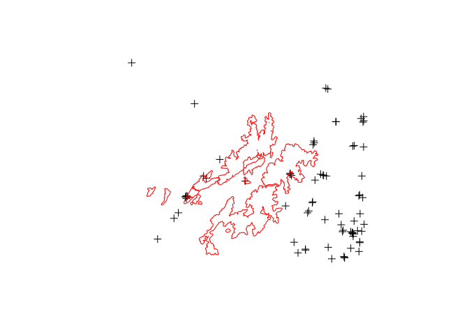

LandTrendr-Paramo - Global Fire Atlas
================
James Millington
2021-07-30

``` r
library(raster)
library(sf)

GFA16 <- st_read("Data/MODIS/Global_Fire_Atlas/Global_fire_atlas_V1_ignitions_2016/Global_fire_atlas_V1_ignitions_2016.shp")
```

    ## Reading layer `Global_fire_atlas_V1_ignitions_2016' from data source `/home/james/wdResearch/LandTrendr-Paramo/Data/MODIS/Global_Fire_Atlas/Global_fire_atlas_V1_ignitions_2016/Global_fire_atlas_V1_ignitions_2016.shp' using driver `ESRI Shapefile'
    ## Simple feature collection with 887221 features and 18 fields
    ## geometry type:  POINT
    ## dimension:      XY
    ## bbox:           xmin: -179.9768 ymin: -49.69785 xmax: 179.9885 ymax: 69.99376
    ## CRS:            4326

``` r
crs(GFA16)
```

    ## [1] "+proj=longlat +datum=WGS84 +no_defs "

Load landsat raster

``` r
dat1 <- raster("Data/ClearImages/ClearJan0.tif")
```

Create polygon of our max study extent

``` r
bb <- bbox(dat1)

#following from https://gis.stackexchange.com/a/403979
bb_pol = st_polygon(
  list(
    cbind(
      bb[1,][c(1,2,2,1,1)], 
      bb[2,][c(1,1,2,2,1)])
  )
)

#set projection to original raster (dat1)
bb_pol = st_sfc(bb_pol, crs="+proj=utm +zone=18 +datum=WGS84 +units=m +no_defs +ellps=WGS84 +towgs84=0,0,0")
#reproject to GFA raster
bb_pol <- st_transform(bb_pol, "+proj=longlat +datum=WGS84 +no_defs")
```

``` r
GFA16_p <- st_intersection(GFA16, bb_pol)
```

    ## although coordinates are longitude/latitude, st_intersection assumes that they are planar

    ## Warning: attribute variables are assumed to be spatially constant throughout all
    ## geometries

``` r
plot(GFA16_p)
```

    ## Warning: plotting the first 9 out of 18 attributes; use max.plot = 18 to plot
    ## all

<!-- -->

Load paramo boundary shapefile

``` r
GISpath <- "/home/james/OneDrive/Research/Projects/ColombiaBIO/Fire/Fire GIS Files/" #linux
buf <- st_read(paste0(GISpath,"500mbufferOfComplejos/GroundTruthingBuffer500m.shp"))

#set crs of shp to same as for cci raster
buf <- st_transform(buf, "+proj=longlat +datum=WGS84 +no_defs")
```

``` r
plot(st_geometry(GFA16_p),col='black',pch=3)
plot(st_geometry(buf),border='red',add=T)
```

<!-- -->

Next Steps - Combined all GFA years? - Filter LTR data by size (min 21
ha)?
